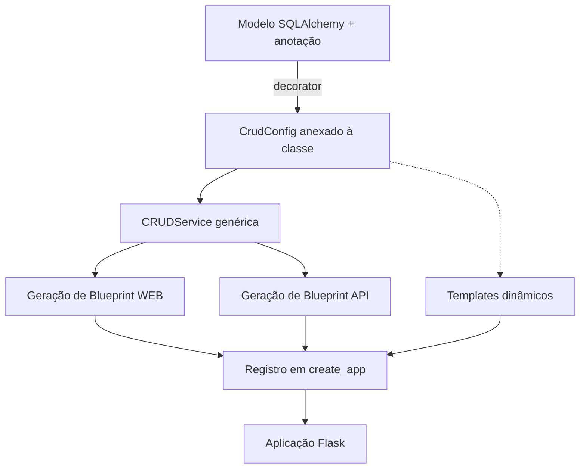
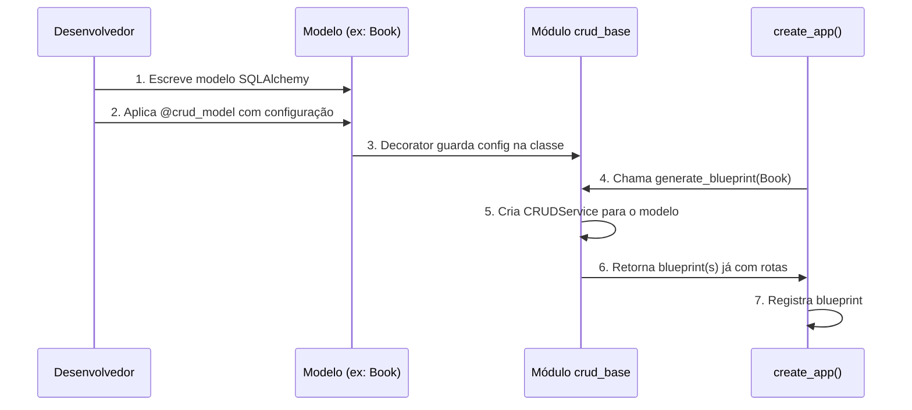
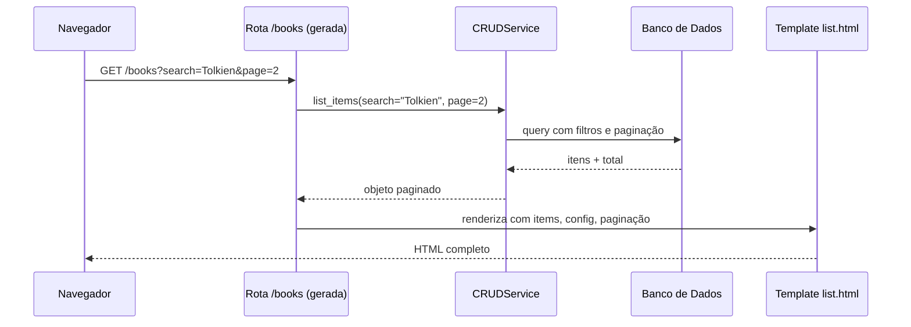
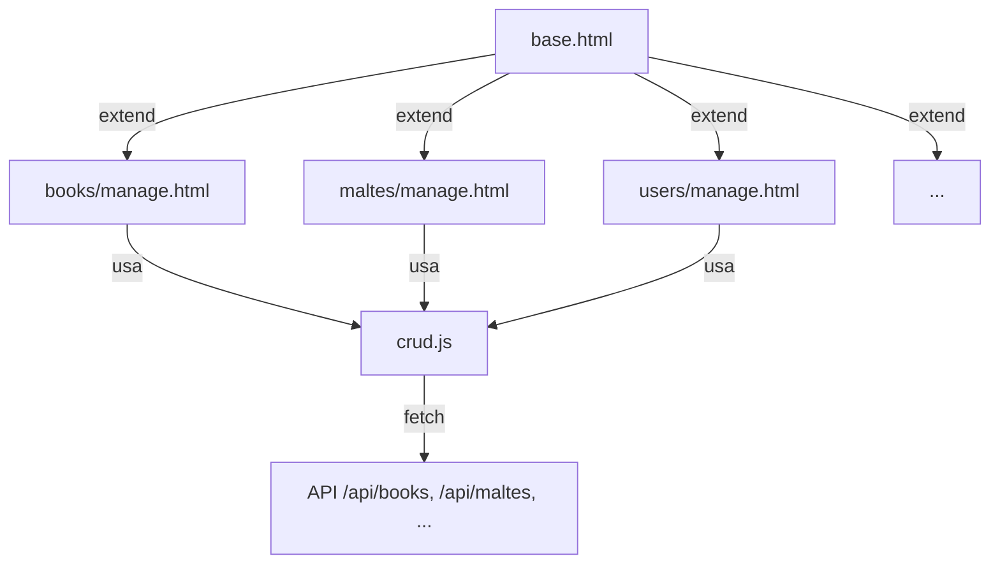

# Especificação: Gerador de CRUD Automático via Anotações no Modelo

## 1. Visão Geral

**Objetivo**  
Permitir que, a partir de um modelo SQLAlchemy com anotações especiais (metadados), todo o código necessário para um CRUD completo seja gerado automaticamente:  
- Rotas web (listagem, criação, edição, detalhe, soft‑delete, restauração, exclusão permanente)  
- Rotas de API (JSON)  
- Serviço de negócio (validações básicas, paginação, busca, ordenação)  
- Templates HTML dinâmicos (listagem, formulário, detalhe)  
- Registro automático de blueprints na aplicação  

**Benefícios**  
- Redução drástica de código repetitivo.  
- Consistência entre todos os CRUDs da aplicação.  
- Facilidade para criar novos módulos (basta anotar o modelo).  
- Manutenção centralizada das funcionalidades comuns.  

## 2. Conceito de “Anotação” Utilizado

Em vez de usar anotações de função (PEP 3107), o sistema usará **decoradores de classe** e **atributos de classe** para anexar metadados ao modelo.  
Essa abordagem permite definir configurações como:

- Quais campos aparecem na listagem (tabela HTML)
- Quais campos são pesquisáveis
- Quais campos são usados em filtros laterais
- Quais campos vão no formulário de criação/edição
- Se o modelo usa soft‑delete (campo de status)
- Prefijo da URL, permissões, etc.

## 3. Artefatos do Sistema

### 3.1 Módulo `crud_base`

Responsável por conter as classes e funções centrais:

- `CrudConfig` – estrutura de configuração (dataclass/objeto).  
- Decorador `@crud_model` – aplicado ao modelo para guardar a configuração.  
- Classe `CRUDService` – implementa lógica de negócio genérica.  
- Funções geradoras de blueprints:  
  - `generate_web_blueprint` – rotas HTML (para o navegador)  
  - `generate_api_blueprint` – rotas JSON (para frontend ou terceiros)  
- Funções auxiliares para renderização de templates dinâmicos.

### 3.2 Modelos Anotados

Exemplo de modelo anotado (descrição):

```
Book (modelo SQLAlchemy)
  - atributos: id, title, author, isbn, status, etc.
  - anotação: @crud_model com configuração
    list_display = ["title", "author", "year", "available"]
    search_fields = ["title", "author"]
    filter_fields = ["genre", "status"]
    form_fields = ["title", "author", "isbn", "year", "genre", "description", "quantity"]
    soft_delete = True
    templates_base = "books"
    url_prefix = "/books"
```

## 4. Fluxo de Funcionamento

### 4.1 Diagrama de Componentes



### 4.2 Fluxo de Criação de um Novo CRUD



### 4.3 Estrutura de Rotas Geradas (para Web)

| Método | Rota                     | Ação principal                              |
|--------|--------------------------|---------------------------------------------|
| GET    | `/books`                 | Listagem paginada com filtros e busca       |
| GET    | `/books/new`             | Formulário de criação (rascunho automático) |
| POST   | `/books`                 | Cria e publica (se não usar soft‑delete)    |
| GET    | `/books/<id>`            | Detalhe do item                             |
| GET    | `/books/<id>/edit`       | Formulário de edição                         |
| PUT    | `/books/<id>`            | Atualiza dados (via AJAX ou formulário)     |
| POST   | `/books/<id>/trash`      | Move para lixeira (soft‑delete)             |
| POST   | `/books/<id>/restore`    | Restaura da lixeira                         |
| DELETE | `/books/<id>/permanent`  | Exclusão definitiva (apenas admin)          |

*Rotas API:* prefixo `/api/books` com os mesmos verbos retornando JSON.

## 5. Comportamento Detalhado dos Componentes

### 5.1 `CrudConfig`

Armazena as seguintes informações (exemplo de propriedades):

- `list_display` – lista de nomes de colunas a exibir na tabela.  
- `search_fields` – colunas onde será feita a busca textual (LIKE).  
- `filter_fields` – colunas que podem ser usadas em filtros por igualdade.  
- `form_fields` – campos a renderizar no formulário de criação/edição.  
- `file_fields` – campos que são upload de arquivo (imagem, documento).  
- `soft_delete` – booleano: se `True`, usa um campo `status` com valores `active`, `trash`.  
- `status_field` – nome do campo que guarda o status (padrão `status`).  
- `templates_base` – diretório dentro de `templates` onde ficarão os arquivos `list.html`, `form.html`, `detail.html`.  
- `url_prefix` – prefixo da URL web.  
- `per_page` – quantidade de itens por página na listagem.  
- `default_sort` – coluna e direção padrão para ordenação.  
- `permissions` – dicionário com funções permitidas para cada ação (ex: `"delete": "is_admin"`).  

### 5.2 Decorador `@crud_model`

- Recebe uma instância de `CrudConfig`.  
- Adiciona à classe do modelo um atributo interno `_crud_config` (ou `__crud_config__`) com essa configuração.  
- Pode também injetar automaticamente um `CRUDService` como atributo de classe.  

### 5.3 `CRUDService` Genérico

Operações implementadas (usando SQLAlchemy e a configuração):

- `list_items(page, per_page, search, filters, sort)` – retorna objeto paginado com os itens, respeitando soft‑delete (só exibe `active` se não for lixeira).  
- `get_item(id)` – obtém por chave primária.  
- `create_item(data)` – cria instância (se soft‑delete, coloca status `active` ou `draft`).  
- `update_item(id, data)` – atualiza campos permitidos (apenas os listados em `form_fields`).  
- `trash_item(id)` – se soft‑delete ativo, muda status para `trash` e registra data.  
- `restore_item(id)` – restaura de `trash` para `active`.  
- `delete_permanent(id)` – remove do banco (requer verificação de permissão).  
- `get_form_fields_metadata()` – retorna metadados de cada campo (tipo, obrigatório, etc.) para renderização de formulário dinâmico.  

### 5.4 Geração de Blueprints

A função `generate_blueprint`:

1. Cria um blueprint web (e outro API) usando o `url_prefix` da configuração.  
2. Para cada rota, define o endpoint, os métodos HTTP e a função de view correspondente.  
3. Nas views web, faz o seguinte:  
   - Chama o `CRUDService` apropriado.  
   - Renderiza templates com o nome base (`templates_base/list.html`, etc.).  
   - Injeta automaticamente no contexto do template: o item (ou lista), a configuração `CrudConfig` e helpers para montar URLs de filtro/ordenação.  
4. Nas views API, serializa os resultados usando `to_dict()` do modelo (se existir) ou um serializador padrão.  

### 5.5 Templates Dinâmicos

Os templates não são gerados em arquivos físicos (embora se possa gerar), mas sim **templates reutilizáveis** que dependem da configuração passada no contexto.

- **`list.html`**:  
  - Exibe tabela com colunas `list_display`.  
  - Acima da tabela, insere barra de busca (se `search_fields` não vazio) e filtros por `filter_fields`.  
  - Coluna de ações com botões “Ver”, “Editar”, “Lixeira” (se soft‑delete), “Restaurar” (quando na lixeira), “Excluir permanente” (para admin).  
  - Paginação automática.  

- **`form.html`**:  
  - Itera sobre `form_fields`.  
  - Para cada campo, descobre o tipo (string, número, data, booleano, foreign key) e renderiza o input apropriado.  
  - Se `file_fields` contiver o campo, renderiza input do tipo file.  
  - Inclui CSRF token e botão de submit.  

- **`detail.html`**:  
  - Exibe todos os campos (ou apenas um conjunto pré‑definido) de forma legível.  
  - Botões de editar, mover para lixeira, etc.  

## 6. Integração com a Aplicação Existente

No `main.py`, dentro da função `register_core_blueprints` (ou similar), deve-se:

1. Iterar por uma lista de modelos que possuem `_crud_config`.  
2. Para cada um, chamar `generate_web_blueprint` e `generate_api_blueprint`.  
3. Registrar ambos os blueprints na aplicação Flask.  

O administrador do projeto pode optar por substituir blueprints manuais (como o `book_bp` atual) pelos gerados automaticamente, ou usá-los apenas para novos modelos.

## 7. Considerações sobre Funcionalidades Específicas do Projeto

- **Soft‑delete com status**: O modelo `Book` já possui `BookStatus` (draft, active, trash). O gerador deve usar `status` como campo de estado e respeitar o ciclo:  
  - Criação → `draft` (se formulário novo) ou `active` (se publicação direta).  
  - Publicação de rascunho → `active`.  
  - Trash → `trash`.  
  - Restaurar → `active`.  

- **Rascunhos (drafts)**: O sistema pode ter uma rota extra `/books/drafts` ou um filtro na listagem (`?status=draft`). O gerador suporta essa distinção via `status_field` e valores predefinidos.  

- **Upload de imagem de capa**: O campo `cover_url` pode ser marcado como `file_field`, fazendo o gerador tratar o upload e salvar o caminho.  

- **Autorização**: As rotas geradas devem usar `@login_required` por padrão. Ações destrutivas (exclusão permanente) devem verificar `current_user.is_admin` conforme a configuração de permissões.  

## 8. Personalização e Pontos de Extensão

- **Validações específicas** podem ser adicionadas no próprio modelo via métodos `validate()` chamados pelo `CRUDService`.  
- **Campos com opções fixas** (ex: `genre`) podem ser renderizados como `select` se o modelo fornecer um método `get_genre_choices()`.  
- **Relacionamentos** (ex: `user_id`) podem ser representados como `select` carregado automaticamente do modelo relacionado.  
- **Templates personalizados** por modelo: se existir o arquivo `templates_base/list_custom.html`, o gerador deve usá-lo em vez do genérico.  

## 9. Diagrama de Sequência de uma Requisição de Listagem



## 10. Possíveis Evoluções Futuras

- **Geração de testes automáticos** a partir da configuração.  
- **Integração com sistema de logs** para registrar ações de CRUD.  
- **Cache** de listagens paginadas com base nos filtros.  
- **Exportação** dos dados listados para Excel/CSV usando a mesma configuração de `list_display`.  


#### Sistema de navegação revisar... 



