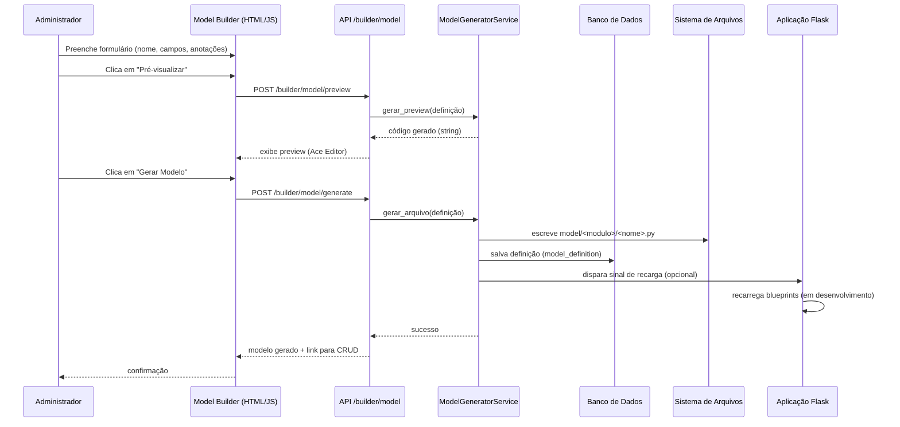
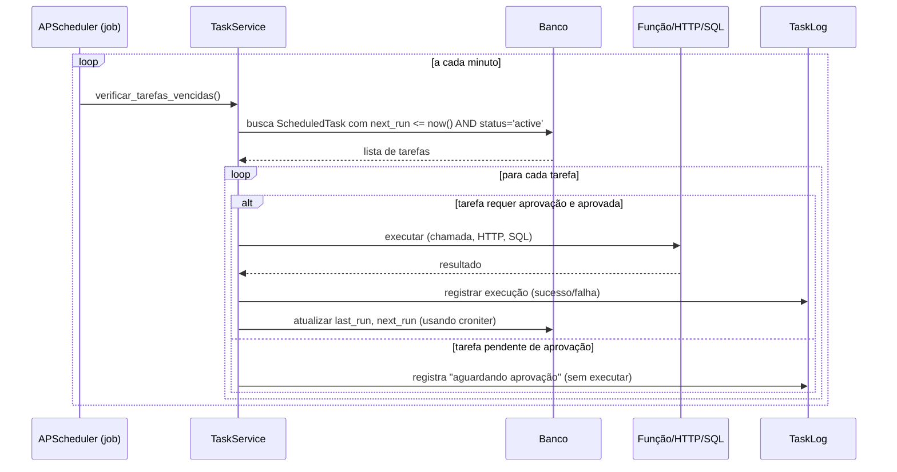

## 🚀 Backlog Atualizado: Pyteca como Plataforma RAD para Construção Rápida de Sistemas

O **Pyteca** evoluiu de um sistema de gerenciamento de biblioteca para uma **plataforma RAD (Rapid Application Development)** que permite criar sistemas completos (CRUD, APIs, dashboards, tarefas agendadas, integrações) a partir de modelos anotados ou via interface visual. Tudo integrado com Flask, SQLAlchemy, Bootstrap, e uma arquitetura que prioriza **reuso**, **consistência** e **extensibilidade**.

A seguir, o **backlog unificado** e atualizado, contemplando:
- O **Gerador de CRUD Automático via Anotações** (já implementado parcialmente)
- O **Model Builder Visual** (interface para criar modelos dinamicamente)
- O **Query & API Playground** (ferramenta para testar SQL e chamadas HTTP, com geração de modelos a partir de respostas JSON)
- O **Monitor de Tarefas e Mensageria** (scheduler, filas, dashboards)
- O **Sistema de Configurações** (centralizado por abas)

---

## 1. Visão Geral da Plataforma

**Propósito**  
Pyteca não é apenas um produto – é uma **base sólida** para construir qualquer sistema corporativo ou web com rapidez, usando uma abordagem de **baixo código** (low‑code) mas mantendo total flexibilidade via código Python.  

**Pilares**  
1. **Geração automática de CRUDs** a partir de modelos SQLAlchemy anotados (decorators).  
2. **Interface visual para criação de modelos** (Model Builder) – ideal para times não‑técnicos ou prototipagem rápida.  
3. **Playground de SQL e APIs** – teste consultas e integrações, e gere modelos a partir de respostas JSON.  
4. **Agendamento de tarefas e filas** – para automação, backups, notificações em lote.  
5. **Central de configurações** – parâmetros do sistema organizados por abas, editáveis via UI.  

**Público‑alvo**  
- Desenvolvedores que querem acelerar a criação de CRUDs.  
- Administradores de sistema que precisam monitorar tarefas e filas.  
- Integradores que consomem APIs externas e desejam mapear respostas para modelos locais.  

---

## 2. Gerador de CRUD Automático via Anotações (Estado Atual + Evoluções)

### 2.1 O que já existe

No código atual, temos:

- `annotations.py`: decorators `@label`, `@plural`, `@listview`, `@form`, `@required`, `@max_length`, etc.  
- `model/bookstore/*.py`: modelos anotados (Author, Book, Loan).  
- `utils/generate_from_model.py`: comando `flask generate --model` que lê um arquivo de modelo, extrai metadados via `get_model_metadata()` e gera:
  - Controller (`controller/.../model.py`)
  - Service (`services/.../model_service.py`)
  - API routes (`api/routes/.../model_routes.py`)
  - Templates (`templates/.../manage.html`, `detail.html`, `_modals/form_modal.html`)
  - Registro automático no menu (via `menu_builder.py` e YAML complementar).

- `utils/smart_list/`: componente reutilizável para listagens paginadas, ordenação, filtros, exportação (CSV, Excel, PDF), e salvamento de layout por usuário.

- `utils/generate_model/template_loader.py`: carrega templates `.j2` de um tema (padrão `standard`) e renderiza com substituição simples.

**Portanto, o gerador já está funcional e atende a maior parte da especificação original.**

### 2.2 Próximas evoluções (a curto prazo)

| Funcionalidade | Descrição | Prioridade |
|----------------|-----------|------------|
| **Suporte a relacionamentos** | No gerador, identificar campos `ForeignKey` e gerar selects dinâmicos (usando `api/options/<tabela>`). Já parcialmente implementado nos modais (`relationship_fields`). | Alta |
| **Upload de arquivos** | Se um campo for anotado como `file_field`, o gerador deve criar input type="file" e salvar o arquivo (ex: capa do livro). | Média |
| **Validações customizadas** | Permitir que o modelo defina um método `validate()` que o service chamará antes de salvar. | Média |
| **Geração automática de testes** | Criar arquivos de teste (pytest) para o CRUD gerado. | Baixa |
| **Exportação dos dados da listagem** | Já existe via SmartList; integrar ao gerador para que o botão “Exportar” apareça automaticamente. | Baixa |

---

## 3. Model Builder Visual (Criação de Modelos pela Interface)

### 3.1 Conceito

Permite que um usuário com permissão de administrador **crie novos modelos diretamente pelo navegador**, sem escrever código Python. O sistema armazena a definição no banco (`model_definition`) e gera o arquivo `.py` do modelo, aplica anotações e executa `db.create_all()`.

### 3.2 Interface

- Página `/admin/model-builder` com duas abas:
  1. **Lista de modelos** (SmartList com colunas: nome, tabela, módulo, status, ações).
  2. **Formulário de criação/edição**:
     - Nome do modelo (ex: `Product`), nome da tabela (`products`), módulo (`sales`).
     - Editor de campos (grid):
       - Nome do campo, tipo (String, Integer, Boolean, Date, DateTime, Text, ForeignKey).
       - Opções: nullable, unique, default, relação (se FK: tabela referenciada).
     - Editor de anotações:
       - `@label`, `@plural`, `@listview` (seleção de colunas, ordenação, filtros), `@form` (grupos de campos), `@required`, etc.
     - Pré‑visualização do código gerado (usando Ace Editor).
  3. Botão **“Gerar Modelo”** → dispara o serviço que escreve o arquivo e recarrega os blueprints (ou emite comando para recarga).

### 3.3 Backend

- **Tabela `model_definition`** (já modelada anteriormente).
- **Serviço `ModelGenerator`**:
  - Lê a definição do banco.
  - Renderiza um template Jinja2 (baseado no mesmo `standard/` do gerador CLI) com os metadados.
  - Salva o arquivo em `model/<module>/<nome_lower>.py`.
  - Opcionalmente, dispara `flask generate --model` (ou chama as funções de geração de CRUD diretamente) para criar controller, service, routes e templates.
  - Executa `db.create_all()` (em desenvolvimento) ou gera migration (Alembic) em produção.

### 3.4 Integração com API Playground

- Após uma requisição de API no playground, o usuário pode clicar em **“Criar Model a partir da resposta”**.
- O sistema analisa o JSON, sugere campos (ex: `{"id": 1, "name": "John"}` → campos `id` (Integer), `name` (String)).
- Abre o modal do Model Builder pré‑preenchido.
- O usuário ajusta e confirma → modelo gerado.

---

## 4. Query & API Playground

### 4.1 Página `/admin/playground` (duas sub‑abas)

#### 🔹 SQL Playground
- Editor SQL (com syntax highlight) – apenas comandos `SELECT`.
- Botão **Executar** → chama endpoint `/api/builder/query/sql` que:
  - Verifica se a query é `SELECT` (bloqueia qualquer outra operação).
  - Executa via `db.session.execute(text(sql))`.
  - Retorna até 1000 linhas em JSON.
- Resultado exibido em tabela (com opção de copiar/exportar CSV).
- **Salvar query** – armazena em `saved_queries` (opcional).

#### 🔹 API Playground
- Interface semelhante ao Postman:
  - Método (GET, POST, PUT, DELETE), URL, Headers (JSON), Body (texto ou JSON).
  - Botão **Enviar** → chama endpoint `/api/builder/query/proxy` que faz a requisição usando `requests` (respeitando whitelist de domínios).
- Resposta exibida formatada (JSON highlight).
- Botão **“Gerar Model a partir desta resposta”** (conforme item 3.4).
- **Histórico** – salva as últimas requisições (opcional).

### 4.2 Segurança

- SQL: apenas `SELECT`. Usar um usuário de banco com permissões `SELECT` apenas.
- Proxy HTTP: whitelist de domínios configurável via `system_config` (ex: `API_WHITELIST = "api.github.com, api.exemplo.com"`). Bloquear IPs privados por padrão.
- Logs completos em `query_log` e `api_log`.

---

## 5. Monitor de Tarefas e Mensageria

### 5.1 Página `/admin/tasks`

#### 🔹 Dashboard de Tarefas
- Cards:
  - Total de tarefas ativas.
  - Tarefas pendentes de aprovação.
  - Tarefas com falha nas últimas 24h.
  - Mensagens na fila.
- Gráficos (ApexCharts):
  - Evolução de execuções por dia (linhas).
  - Distribuição por status (barras).
  - Top 5 tarefas mais lentas (barras horizontais).
- Tabela de **últimas execuções** (TaskLog) com colunas: tarefa, início, fim, duração, status, resultado.

#### 🔹 Lista de Tarefas Agendadas (ScheduledTask)
- SmartList com ações: editar, pausar, ativar, executar agora, aprovar (se pendente).
- Formulário de criação/edição:
  - Nome, tipo (`python_call`, `http_request`, `sql`).
  - `target`: caminho da função (ex: `services.tasks.backup_db`), URL, ou SQL.
  - Agendamento (cron string ou intervalo em minutos).
  - Flag `requires_approval`.
- Botão **“Executar Agora”** – executa imediatamente (útil para testes).

#### 🔹 Fila de Mensagens (MessageQueue)
- Lista de mensagens pendentes, em processamento, com erro.
- Possibilidade de reprocessar mensagens com erro.
- Ações: cancelar, priorizar.

### 5.2 Worker e Scheduler

- **APScheduler** inicializado com a aplicação (job store no banco).
- Um job recorrente (a cada 10 segundos) processa `MessageQueue` (envia e-mails, notificações, webhooks).
- Outro job (a cada minuto) verifica `ScheduledTask` com `next_run <= now()` e status `active`, e dispara execução (respeitando aprovação).
- **TaskLog** registra cada execução (início, fim, sucesso, erro).

### 5.3 Exemplo de Tarefa Interna

Registrar funções elegíveis em um dicionário central (`TASK_REGISTRY`) para segurança:

```python
TASK_REGISTRY = {
    "backup_db": backup_database_function,
    "send_daily_report": send_report,
}
```

Ao criar uma tarefa do tipo `python_call`, o `target` deve ser uma chave desse registro.

---

## 6. Central de Configurações (`/admin/config`)

### 6.1 Interface

- Abas (definidas pelo campo `group` na tabela `system_config`):
  - **Geral** (nome do sistema, fuso horário, timeout)
  - **E-mail** (servidor SMTP, remetente)
  - **API Whitelist** (domínios permitidos para o playground)
  - **Segurança** (max login attempts, tempo de sessão)
  - **Personalização** (tema, logo, rodapé)

- Cada grupo exibe os campos correspondentes, com tipos apropriados (string, bool, número, textarea para JSON).
- Ações: **Salvar**, **Resetar para padrão**, **Exportar/Importar** (JSON).

### 6.2 Acesso programático

Serviço `ConfigService` fornece métodos:

```python
get_config(key: str, default=None)
set_config(key: str, value: Any, type: str = "string")
```

As configurações são cacheadas (ex: por 5 minutos) para evitar acesso ao banco a cada requisição.

---

## 7. Diagramas de Arquitetura e Fluxos (enriquecidos)

### 7.1 Visão Geral da Plataforma

```mermaid
graph TB
    subgraph "Camada de Apresentação (Templates + JS)"
        A[base.html]
        B[manage.html]
        C[model_builder.html]
        D[playground.html]
        E[tasks.html]
        F[config.html]
    end

    subgraph "Blueprints (Controllers)"
        G[controller/bookstore/*]
        H[controller/admin/*]
        I[api/routes/core/builder/*]
    end

    subgraph "Camada de Serviços"
        J[services/bookstore/*]
        K[services/admin/*]
        L[CRUDService Genérico (futuro)]
    end

    subgraph "Persistência"
        M[(SQLite/PostgreSQL)]
        N[model/*.py]
    end

    subgraph "Ferramentas de Geração"
        O[utils/generate_from_model.py]
        P[Model Builder Visual]
        Q[API Playground → Geração]
    end

    A --> B
    B --> G
    C --> H
    D --> I
    E --> H
    F --> H

    G --> J
    H --> K
    I --> K

    J --> N
    K --> N
    N --> M

    O -.-> N
    P -.-> O
    Q -.-> P
```

### 7.2 Fluxo de Criação de um Novo Modelo via Interface Visual


```mermaid
sequenceDiagram
    participant Admin as Administrador
    participant UI as Model Builder (HTML/JS)
    participant API as API /builder/model
    participant Service as ModelGeneratorService
    participant DB as Banco de Dados
    participant FS as Sistema de Arquivos
    participant App as Aplicação Flask

    Admin->>UI: Preenche formulário (nome, campos, anotações)
    Admin->>UI: Clica em "Pré‑visualizar"
    UI->>API: POST /builder/model/preview
    API->>Service: gerar_preview(definição)
    Service-->>API: código gerado (string)
    API-->>UI: exibe preview (Ace Editor)
    Admin->>UI: Clica em "Gerar Modelo"
    UI->>API: POST /builder/model/generate
    API->>Service: gerar_arquivo(definição)
    Service->>FS: escreve model/<modulo>/<nome>.py
    Service->>DB: salva definição (model_definition)
    Service->>App: dispara sinal de recarga (opcional)
    App->>App: recarrega blueprints (em desenvolvimento)
    Service-->>API: sucesso
    API-->>UI: modelo gerado + link para CRUD
    UI-->>Admin: confirmação
```

### 7.3 Fluxo de Execução de uma Tarefa Agendada (com aprovação)


```mermaid
sequenceDiagram
    participant Scheduler as APScheduler (job)
    participant Service as TaskService
    participant DB as Banco
    participant Task as Função/HTTP/SQL
    participant Log as TaskLog

    loop a cada minuto
        Scheduler->>Service: verificar_tarefas_vencidas()
        Service->>DB: busca ScheduledTask com next_run <= now() AND status='active'
        DB-->>Service: lista de tarefas
        loop para cada tarefa
            alt tarefa requer aprovação e aprovada
                Service->>Task: executar (chamada, HTTP, SQL)
                Task-->>Service: resultado
                Service->>Log: registrar execução (sucesso/falha)
                Service->>DB: atualizar last_run, next_run (usando croniter)
            else tarefa pendente de aprovação
                Service->>Log: registra "aguardando aprovação" (sem executar)
            end
        end
    end
```

---

## 8. Próximos Passos (Implementação)

Com base na aprovação deste backlog, a equipe deve executar na seguinte ordem:

1. **Modelos de dados** (criar as tabelas `system_config`, `model_definition`, `scheduled_task`, `message_queue`, `task_log`, `query_log`).
2. **Serviços base** (`ConfigService`, `ModelGeneratorService`).
3. **Endpoints da API Builder** (model_builder_api, query_api, playground_api).
4. **Interface do Model Builder** (página com editor de campos e pré‑visualização).
5. **Interface do Playground** (SQL + API).
6. **Integração da Geração de Modelo a partir da Resposta da API**.
7. **Implementação do Scheduler e Worker** (APScheduler, processamento de fila).
8. **Páginas de Tasks e Mensageria** (listagem, aprovação, dashboards gráficos).
9. **Página de Configurações** (abas).

Cada etapa será entregue com testes unitários e de integração.

---

## 9. Considerações Finais

O Pyteca, com essa especificação, se torna uma **verdadeira plataforma RAD** que permite:

- Desenvolvedores tradicionais usarem anotações nos modelos para geração instantânea de CRUDs completos.
- Administradores ou analistas criarem novos modelos via interface visual, sem escrever código.
- Qualquer usuário técnico testar queries SQL e APIs externas, e **gerar modelos automaticamente** a partir de respostas JSON.
- Automatizar tarefas recorrentes (backups, integrações, envio de e-mails) com agendamento e aprovação.
- Monitorar tudo através de dashboards elegantes e configurar o sistema sem editar arquivos.

Tudo isso mantendo a flexibilidade de um framework Flask tradicional, permitindo personalização em qualquer camada.
