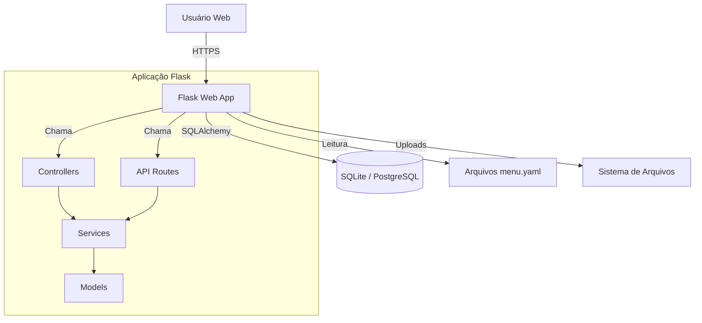
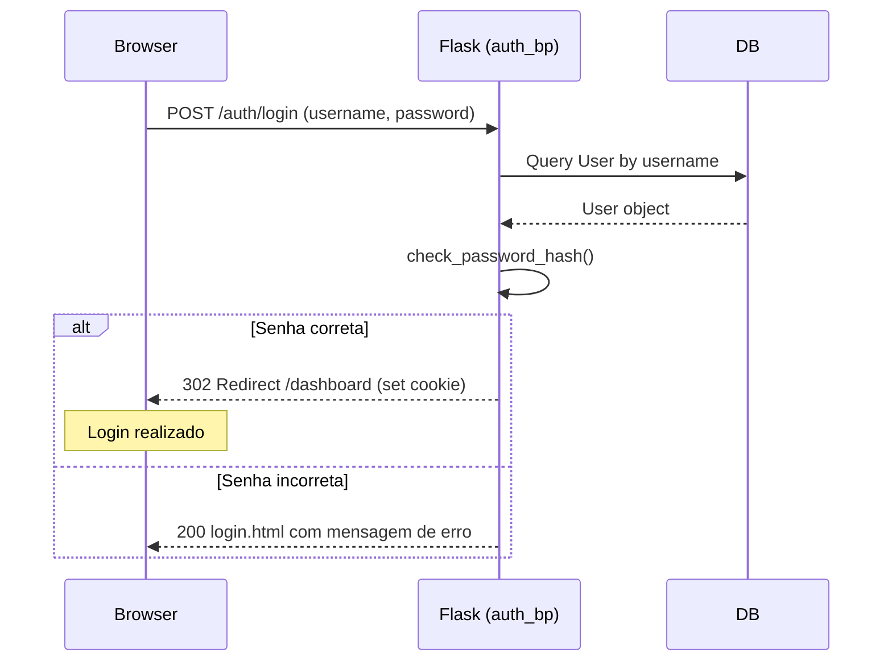
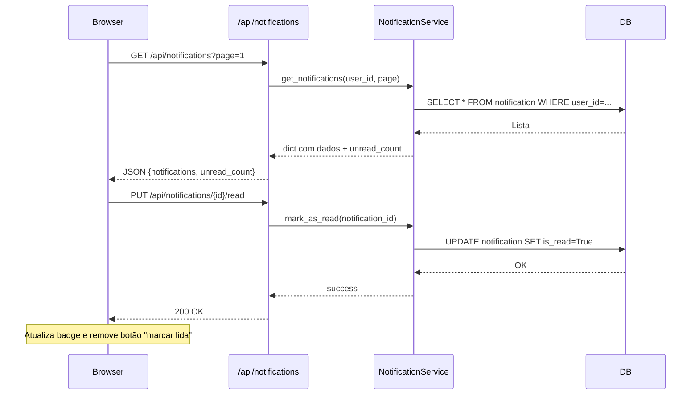
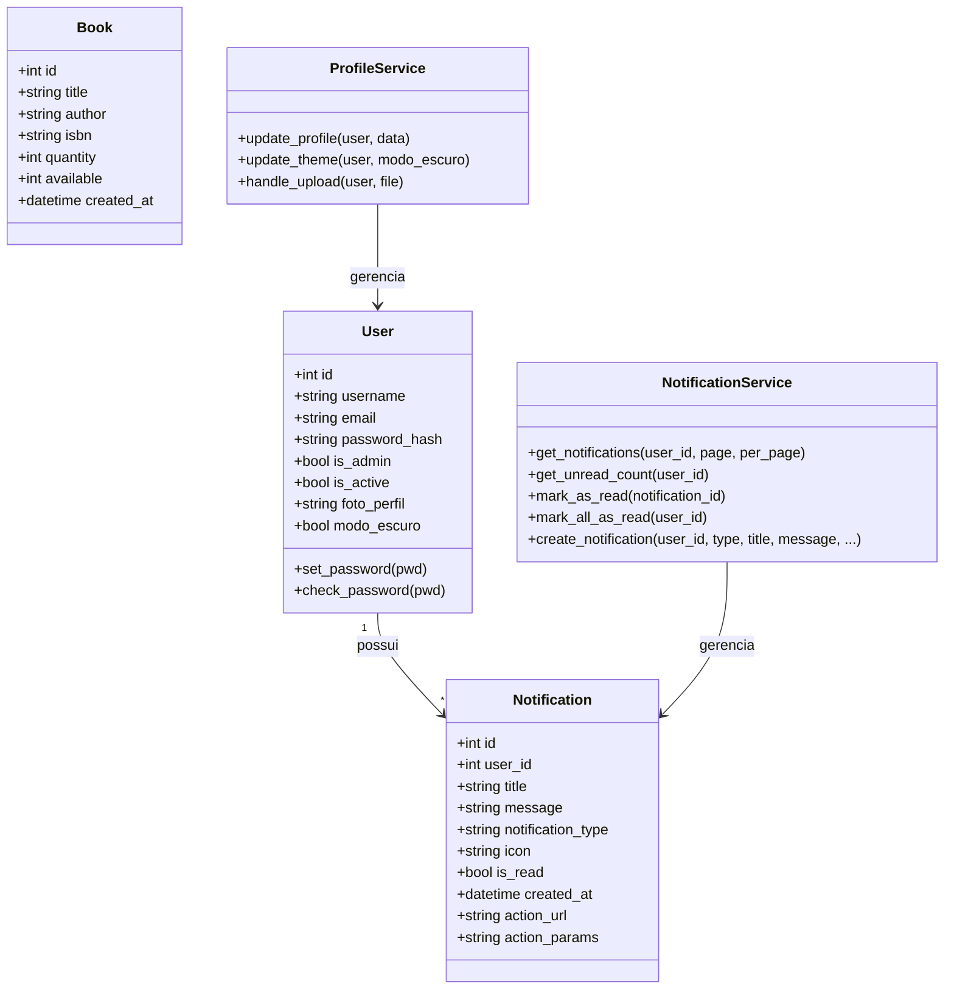

# Biblioteca 1.0 – Documentação de Arquitetura

## Visão Geral
Este projeto é um sistema de gerenciamento de biblioteca (livros, usuários e notificações) desenvolvido com **Flask**, utilizando renderização server‑side (HTML) e APIs REST para operações assíncronas. A interface é construída sobre o template Bootstrap “NiceAdmin” e suporta tema claro/escuro.

### Principais Tecnologias
- **Backend**: Python 3.10+, Flask, SQLAlchemy, Flask-Login, PyYAML, Flask-CORS
- **Banco de Dados**: SQLite (dev) / PostgreSQL (produção, configurável)
- **Frontend**: Jinja2, Bootstrap 5, JavaScript (Vanilla)
- **Infra**: Gunicorn (produção), Logging configurável

---

## Estrutura de Pastas e Responsabilidades

```
src/
├── api/                    # Rotas REST (APIs)
│   └── routes/
│       ├── auth_routes.py      # Autenticação (login/logout, update theme)
│       ├── notifications_routes.py # CRUD de notificações
│       ├── register.py         # Registro de usuário
│       └── upload_routes.py    # Upload de arquivos (fotos de perfil, etc.)
├── controller/             # Controladores de páginas web (server-side)
│   ├── auth.py                 # Telas de login/registro
│   ├── web.py                  # Dashboard, perfil, notificações (HTML)
│   ├── modelo_notifications.py # Páginas de listagem de notificações
│   └── api.py                  # (opcional) rotas utilitárias
├── db/                     # Configuração e conexão com banco de dados
│   ├── database.py             # Fábrica de conexão (SQLite/PostgreSQL)
│   ├── dev_database.py         # Configuração para desenvolvimento
│   └── prd_database.py         # Configuração para produção
├── model/                  # Modelos de dados (ORM SQLAlchemy)
│   ├── user.py
│   ├── book.py
│   ├── notification.py
├── services/               # Lógica de negócio
│   ├── notifications_service.py # Criação, consulta e manipulação de notificações
│   └── profile_service.py       # Lógica de perfil (foto, temas)
├── templates/              # Templates Jinja2 + arquivos de menu YAML
│   ├── base.html            # Layout principal (sidebar, header, notificações JS)
│   ├── login.html, register.html, profile.html, notifications.html, …
│   └── menu.yaml            # Menu dinâmico (pode existir dentro de subpastas)
├── utils/                  # Utilitários de desenvolvimento
│   ├── dev_setup.py          # Criação de admin inicial
│   └── dump_project.py       # Geração do dump de código
├── logs/                   # Configuração de logging
├── tests/                  # Testes unitários
├── main.py                 # Fábrica da aplicação, registro de blueprints e CLI
└── requirements.txt
```

### Responsabilidades Detalhadas

| Pasta/Arquivo | Função |
|---------------|--------|
| `api/routes/` | Expõe endpoints JSON para consumo assíncrono (ex.: carregar notificações, marcar como lida). Não retorna HTML. |
| `controller/` | Lida com páginas web tradicionais: recebe requisições, processa com serviços e renderiza templates com `render_template`. |
| `services/` | Camada de negócio pura, sem dependência do Flask. Orquestra modelos e regras. Ex.: `notifications_service.get_unread_count(user_id)`. |
| `model/` | Definição das entidades e relacionamentos. Usa SQLAlchemy. |
| `templates/` | Layouts HTML e componentes de interface. O sistema de menu é alimentado por arquivos `menu.yaml` na raiz ou subpasta correspondente à seção. |
| `db/` | Gerencia a engine e sessão do banco de dados, escolhendo configuração conforme ambiente (`DEV`/`PRD`). |
| `utils/` | Scripts auxiliares como criação de admin padrão ou dump do projeto. |
| `logs/` | Configuração centralizada de logging (arquivo e console). |

---

## Arquitetura de Alto Nível

A aplicação segue uma arquitetura **MVC modificada**, com separação clara entre:
- **Model** (`model/`)
- **View** (`templates/` + controladores que renderizam)
- **Controller** (`controller/` para páginas, `api/` para APIs)
- **Service** (`services/`) para evitar lógica complexa nos controllers.

O fluxo típico de uma requisição web (página) é:
1. Browser → `controller/web.py` → `services/` (se necessário) → `model/` → Banco de Dados.
2. Controller monta o contexto e renderiza um template.

Para APIs:
1. Browser → `api/routes/` → `services/` → `model/` → DB, retornando JSON.

### Sistema de Menu Dinâmico
O menu lateral é gerado a partir de arquivos YAML localizados em `templates`. A lógica (em `main.py`) lê o primeiro segmento da URL e carrega `templates/<seção>/menu.yaml`. Exemplo: ao acessar `/livros`, busca `templates/livros/menu.yaml`. Um arquivo `templates/menu.yaml` serve como fallback global.

---

## Diagramas

### 1. C4 – Contexto do Sistema (Nível 1)
```mermaid
graph TD
    U[Usuário] -->|HTTP| S[Sistema de Biblioteca]
    S -->|SQL| D[(Banco de Dados)]
    S -->|Arquivos| FS[Sistema de Arquivos (uploads)]
```
O sistema é um website monolítico que atende usuários autenticados e administradores.

### 2. C4 – Container (Nível 2)

A aplicação Flask contém os módulos internos. Ambos controllers e API routes acessam a camada de serviços, que por sua vez manipula os modelos.

### 3. Diagrama de Sequência – Login

Após login bem‑sucedido, o Flask‑Login cria uma sessão e redireciona para o dashboard.

### 4. Diagrama de Sequência – Sistema de Notificações

A interface mantém polling a cada 30 segundos e atualiza dinamicamente o contador de não lidas.

### 5. Diagrama de Classes – Core do Sistema

**Observação:** Os modelos `User` e `Book` possuem relacionamento implícito (empréstimos) que ainda não está detalhado no dump atual; o diagrama reflete apenas as classes e serviços já implementados.

---

## Como Executar

1. Clone o repositório e acesse a pasta `src/`.
2. Instale as dependências:
   ```bash
   pip install -r requirements.txt
   ```
3. Configure as variáveis de ambiente (crie um arquivo `.env` na raiz ou em `src/` com base em `.env.example`). Exemplo mínimo:
   ```
   SECRET_KEY=uma-chave-secreta
   FLASK_ENV=DEV
   ```
4. Inicialize o banco e crie o administrador padrão:
   ```bash
   flask init-db
   flask init-admin
   ```
5. Execute a aplicação:
   ```bash
   python main.py
   ```
   Acesse `http://localhost:5000` e faça login com as credenciais padrão (`admin` / `admin123`).

---

## Próximos Passos
- Implementar empréstimos e reservas de livros.
- Adicionar testes automatizados para todos os serviços.
- Migrar notificações para WebSockets em produção.
- Criar painel administrativo completo com CRUD de livros.
- Internacionalização (i18n).

