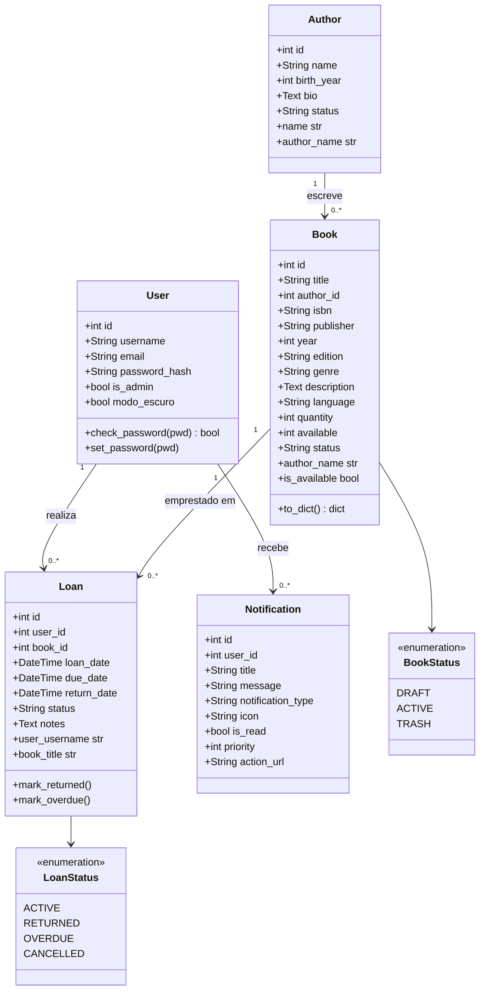
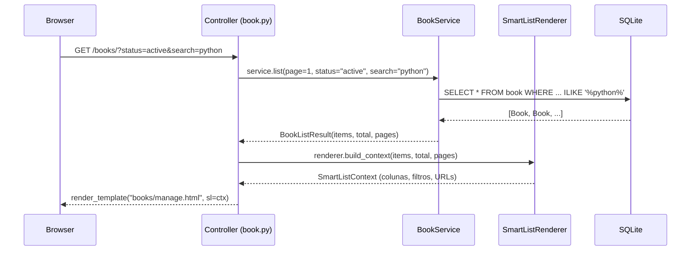
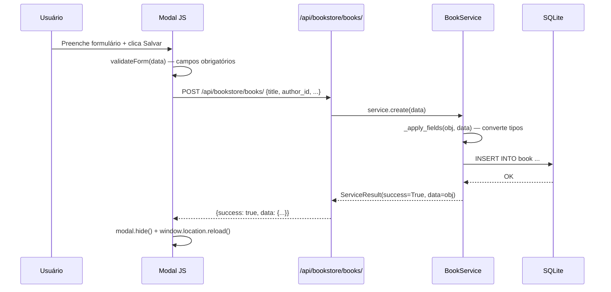
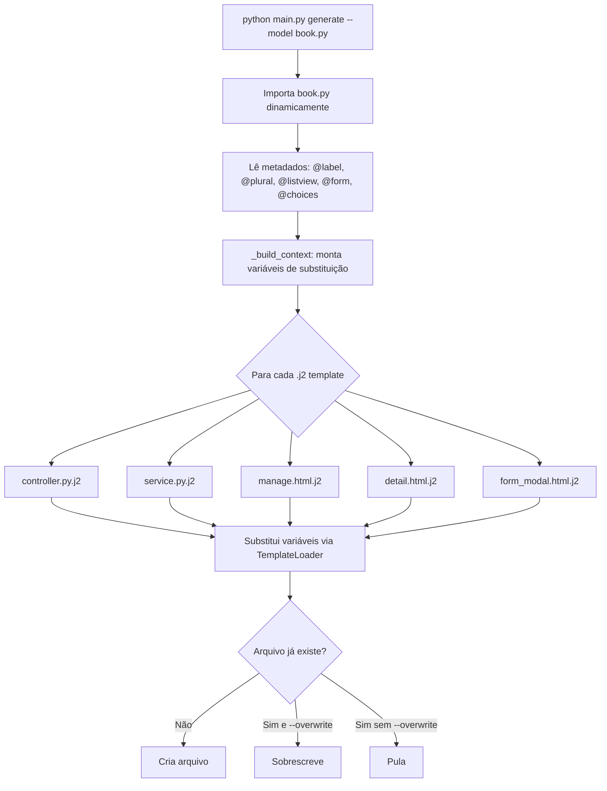
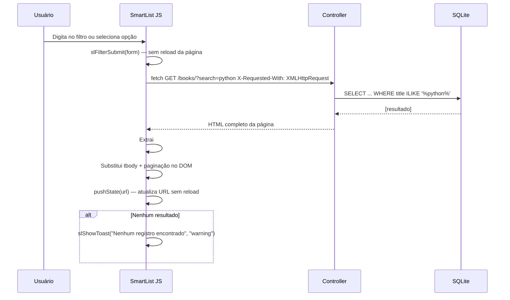

# PyTeca — Sistema de Gerenciamento de Biblioteca

> **Stack**: Flask · SQLAlchemy · Bootstrap 5 · Nice Admin · SQLite (dev)  
> **Python**: 3.10+ · **Repo**: https://github.com/ChristopherNicolasSMM/PyTeca

---

## Índice

1. [Visão Geral](#visão-geral)
2. [Estrutura de Pastas](#estrutura-de-pastas)
3. [Fluxo de Trabalho — Novo Model](#fluxo-de-trabalho--novo-model)
4. [Geração de Código (CrudGen)](#geração-de-código-crudgen)
5. [Diagramas de Classe](#diagramas-de-classe)
6. [Diagramas de Fluxo](#diagramas-de-fluxo)
7. [Anotações do Model (`annotations/`)](#anotações-do-model-annotations)
8. [SmartList](#smartlist)
9. [Templates Jinja2 e Geração `.j2`](#templates-jinja2-e-geração-j2)
10. [API REST](#api-rest)
11. [Guia de Manutenção](#guia-de-manutenção)
12. [Armadilhas Conhecidas](#armadilhas-conhecidas)
13. [Como Executar](#como-executar)

---

## Visão Geral

O PyTeca é um sistema RAD (Rapid Application Development) de biblioteca que demonstra um padrão de geração automática de CRUD a partir de modelos anotados. Um único comando gera controller, service, routes e templates HTML para qualquer model novo.

```
Model + Anotações  →  generate_from_model.py  →  Controller + Service + Templates
```

---

## Estrutura de Pastas

```
src/
├── annotations/             # Decorators @label, @plural, @listview, @form, @choices, etc.
│   └── __init__.py
├── api/
│   └── routes/
│       ├── bookstore/       # book_routes.py, author_routes.py, loan_routes.py
│       └── core/            # notifications_routes.py, options_routes.py, smart_list_routes.py
├── controller/
│   ├── bookstore/           # book.py, author.py, loan.py  ← GERADOS (nunca editar direto)
│   └── core/                # web.py, auth.py, admin/...
├── model/
│   ├── bookstore/           # book.py, author.py, loan.py  ← editar aqui
│   └── core/                # user.py, notification.py, ...
├── services/
│   ├── bookstore/           # book_service.py, ...  ← GERADOS (nunca editar direto)
│   └── core/
├── templates/
│   ├── _components/         # smart_list.html (componente reutilizável)
│   ├── bookstore/
│   │   ├── books/           # manage.html, detail.html, _modals/book_form_modal.html
│   │   ├── authors/
│   │   └── loans/
│   └── core/                # base.html, login.html, dashboard.html, ...
├── utils/
│   ├── generate_from_model.py   # CLI principal do gerador
│   ├── smart_list/              # config.py, renderer.py, export.py
│   └── generate_model/
│       └── templates/
│           └── standard/        # *.j2 — templates do gerador (editar aqui)
│               ├── controller.py.j2
│               ├── service.py.j2
│               ├── routes.py.j2
│               ├── manage.html.j2
│               ├── detail.html.j2
│               └── form_modal.html.j2
├── static/
│   └── css/                 # style.css, style_dark.css, themes.css, smart_list.css, playground.css
└── main.py                  # create_app(), filtros Jinja, auto-discovery de blueprints
```

**Regra de ouro**: Controllers, Services e Templates HTML em `templates/bookstore/` são **gerados**. Corrija sempre nos `.j2` e regenere.

---

## Fluxo de Trabalho — Novo Model

```
1. Criar o model em model/bookstore/meu_model.py
   ↓
2. Adicionar anotações: @label, @plural, @listview, @form, @display_field, @required, @choices
   ↓
3. Rodar o gerador:
   python main.py generate --model model/bookstore/meu_model.py
   ↓
4. Registrar blueprint (automático via pkgutil.walk_packages)
   ↓
5. Testar: criar, editar, lixeira, restaurar, excluir permanente
   ↓
6. Se precisar de ajuste: editar o .j2 correspondente + --overwrite
```

### Checklist completo de novo model

```
[ ] model com __tablename__, Mapped fields, Status Enum
[ ] @label, @plural, @listview (columns + filters), @form (fields + groups)
[ ] @display_field("campo")  — obrigatório para FK dropdown
[ ] @required para cada campo obrigatório
[ ] @choices("campo") para filtros com SELECT DISTINCT
[ ] cascade="all, delete-orphan" em relacionamentos filhos
[ ] @property planas para cada FK usada em listagem (ex: author_name)
[ ] to_dict() retornando status.value e campo_name para cada FK
[ ] python main.py generate --model ... (--overwrite após ajustes)
[ ] Testar CRUD completo
```

---

## Geração de Código (CrudGen)

### Comando

```bash
# Primeira geração
python main.py generate --model model/bookstore/book.py

# Forçar sobrescrita (após corrigir .j2)
python main.py generate --model model/bookstore/book.py --overwrite

# Regenerar todos
python main.py generate --model model/bookstore/book.py --overwrite
python main.py generate --model model/bookstore/loan.py --overwrite
python main.py generate --model model/bookstore/author.py --overwrite
```

### O que é gerado

| Arquivo gerado | Template j2 |
|---|---|
| `controller/bookstore/book.py` | `controller.py.j2` |
| `services/bookstore/book_service.py` | `service.py.j2` |
| `templates/bookstore/books/manage.html` | `manage.html.j2` |
| `templates/bookstore/books/detail.html` | `detail.html.j2` |
| `templates/bookstore/books/_modals/book_form_modal.html` | `form_modal.html.j2` |

### Como o gerador funciona

`generate_from_model.py` lê o arquivo `.py` do model via importação dinâmica, extrai os metadados das anotações, constrói um dicionário de contexto e passa para o `TemplateLoader` que substitui as variáveis nos `.j2`.

Variáveis disponíveis nos templates `.j2`:

| Variável | Exemplo | Descrição |
|---|---|---|
| `{{ class_name }}` | `Book` | Nome da classe Python |
| `{{ class_name_lower }}` | `book` | Nome em minúsculas |
| `{{ label }}` | `Livros` | Label do @label |
| `{{ plural }}` | `books` | Plural do @plural |
| `{{ output_subdir }}` | `bookstore` | Subdiretório de saída |
| `{{ module_name }}` | `book` | Nome do módulo Python |
| `{{ columns }}` | `ColumnDef(...),...` | Colunas SmartList geradas |
| `{{ filters }}` | `FilterDef(...),...` | Filtros SmartList gerados |
| `{{ form_fields }}` | HTML dos campos | Campos do modal |
| `{{ fields_rows }}` | HTML das linhas | Linhas do detail |
| `{{ relationship_fields }}` | lista de dicts | Campos FK |
| `{{ enum_fields }}` | lista de dicts | Campos Enum |
| `{{ date_fields }}` | lista de strings | Campos de data |
| `{{ required_fields }}` | lista de strings | Campos obrigatórios |
| `{{ search_block }}` | código Python | Bloco de busca do service |

---

## Diagramas de Classe


```mermaid
classDiagram
    class User {
        +int id
        +String username
        +String email
        +String password_hash
        +bool is_admin
        +bool modo_escuro
        +check_password(pwd) bool
        +set_password(pwd)
    }

    class Author {
        +int id
        +String name
        +int birth_year
        +Text bio
        +String status
        +name str
        +author_name str
    }

    class Book {
        +int id
        +String title
        +int author_id
        +String isbn
        +String publisher
        +int year
        +String edition
        +String genre
        +Text description
        +String language
        +int quantity
        +int available
        +String status
        +author_name str
        +is_available bool
        +to_dict() dict
    }

    class Loan {
        +int id
        +int user_id
        +int book_id
        +DateTime loan_date
        +DateTime due_date
        +DateTime return_date
        +String status
        +Text notes
        +user_username str
        +book_title str
        +mark_returned()
        +mark_overdue()
    }

    class Notification {
        +int id
        +int user_id
        +String title
        +String message
        +String notification_type
        +String icon
        +bool is_read
        +int priority
        +String action_url
    }

    class BookStatus {
        <<enumeration>>
        DRAFT
        ACTIVE
        TRASH
    }

    class LoanStatus {
        <<enumeration>>
        ACTIVE
        RETURNED
        OVERDUE
        CANCELLED
    }

    Author "1" --> "0..*" Book : escreve
    User "1" --> "0..*" Loan : realiza
    Book "1" --> "0..*" Loan : emprestado em
    User "1" --> "0..*" Notification : recebe
    Book --> BookStatus
    Loan --> LoanStatus
```

---

## Diagramas de Fluxo

### Fluxo de Requisição Web (página)


```mermaid
sequenceDiagram
    participant B as Browser
    participant C as Controller (book.py)
    participant S as BookService
    participant R as SmartListRenderer
    participant DB as SQLite

    B->>C: GET /books/?status=active&search=python
    C->>S: service.list(page=1, status="active", search="python")
    S->>DB: SELECT * FROM book WHERE ... ILIKE '%python%'
    DB-->>S: [Book, Book, ...]
    S-->>C: BookListResult(items, total, pages)
    C->>R: renderer.build_context(items, total, pages)
    R-->>C: SmartListContext (colunas, filtros, URLs)
    C-->>B: render_template("books/manage.html", sl=ctx)
```

### Fluxo de Criação (modal → API)


```mermaid
sequenceDiagram
    participant U as Usuário
    participant M as Modal JS
    participant API as /api/bookstore/books/
    participant S as BookService
    participant DB as SQLite

    U->>M: Preenche formulário + clica Salvar
    M->>M: validateForm(data) — campos obrigatórios
    M->>API: POST /api/bookstore/books/ {title, author_id, ...}
    API->>S: service.create(data)
    S->>S: _apply_fields(obj, data) — converte tipos
    S->>DB: INSERT INTO book ...
    DB-->>S: OK
    S-->>API: ServiceResult(success=True, data=obj)
    API-->>M: {success: true, data: {...}}
    M->>M: modal.hide() + window.location.reload()
```

### Fluxo do Gerador de Código


```mermaid
flowchart TD
    A[python main.py generate --model book.py] --> B[Importa book.py dinamicamente]
    B --> C[Lê metadados: @label, @plural, @listview, @form, @choices]
    C --> D[_build_context: monta variáveis de substituição]
    D --> E{Para cada .j2 template}
    E --> F[controller.py.j2]
    E --> G[service.py.j2]
    E --> H[manage.html.j2]
    E --> I[detail.html.j2]
    E --> J[form_modal.html.j2]
    F --> K[Substitui variáveis via TemplateLoader]
    G --> K
    H --> K
    I --> K
    J --> K
    K --> L{Arquivo já existe?}
    L -->|Não| M[Cria arquivo]
    L -->|Sim e --overwrite| N[Sobrescreve]
    L -->|Sim sem --overwrite| O[Pula]
```

### Fluxo do Filtro AJAX (SmartList)


```mermaid
sequenceDiagram
    participant U as Usuário
    participant SL as SmartList JS
    participant C as Controller
    participant DB as SQLite

    U->>SL: Digita no filtro ou seleciona opção
    SL->>SL: slFilterSubmit(form) — sem reload da página
    SL->>C: fetch GET /books/?search=python X-Requested-With: XMLHttpRequest
    C->>DB: SELECT ... WHERE title ILIKE '%python%'
    DB-->>C: [resultado]
    C-->>SL: HTML completo da página
    SL->>SL: Extrai #sl-table-wrap e #sl-pagination via DOMParser
    SL->>SL: Substitui tbody + paginação no DOM
    SL->>SL: pushState(url) — atualiza URL sem reload
    alt Nenhum resultado
        SL->>SL: slShowToast("Nenhum registro encontrado", "warning")
    end
```

---

## Anotações do Model (`annotations/`)

### Referência completa

```python
from annotations import (
    label,          # @label("Livros") — nome singular para UI
    plural,         # @plural("books") — usado em URLs e endpoints
    listview,       # @listview(columns=[...], filters=[...]) — config da SmartList
    Column,         # Column("campo", label="Label", sortable=True, width="100px")
    Filter,         # Filter("campo", type="text|select|boolean", placeholder="...")
    form,           # @form(fields=["campo1", ...], groups=[...])
    Group,          # Group("id", "Label do grupo", ["campo1", "campo2"], collapsible=True)
    required,       # @required("campo", "Mensagem de erro")
    max_length,     # @max_length("campo", 100)
    display_field,  # @display_field("name") — campo exibido no FK dropdown
    choices,        # @choices("genre", label="Gênero") — SELECT DISTINCT no filtro
    menu_icon,      # @menu_icon("bi-book") — ícone no menu lateral
    menu_parent,    # @menu_parent("Biblioteca") — item pai no menu
)
```

### `@choices` — Filtro com SELECT DISTINCT

```python
@choices("genre",    label="Gênero")
@choices("language", label="Idioma")
@label("Livros")
@plural("books")
class Book(db.Model):
    genre:    Mapped[str] = mapped_column(String(60))
    language: Mapped[str] = mapped_column(String(30), default="Português")
```

O gerador cria automaticamente um `FilterDef` com `options=lambda` que executa `SELECT DISTINCT genre FROM book` ao carregar a lista. O filtro se atualiza conforme os dados reais do banco.

---

## SmartList

### Componente reutilizável de listagem

A SmartList é o componente central de listagem. Suporta:
- Ordenação por coluna (com direção asc/desc)
- Filtros texto, select e boolean
- Paginação
- Exportação CSV, Excel, PDF
- Layout personalizado por usuário (colunas reordenáveis e ocultáveis)
- Filtros AJAX (atualiza só a tabela, sem reload da página)

### Uso no template

```jinja


{{ smart_list(sl, row_actions=_row_actions) }}


{{ sl_scripts() }}

```

### FilterDef — tipos disponíveis

| type | Comportamento | options |
|---|---|---|
| `"text"` | Input com debounce, filtra ao clicar Filtrar ou Enter | — |
| `"select"` | Select que filtra ao mudar (AJAX) | `[(value, label), ...]` ou `callable` |
| `"boolean"` | Toggle switch | — |

### ColumnDef — parâmetros

```python
ColumnDef(
    key="author_name",    # campo no objeto ORM (sem pontos!)
    label="Autor",
    sortable=False,       # só colunas diretas do DB
    width="150px",        # None = automático
    align="start",        # "start" | "center" | "end"
    hidden_default=False, # começa oculta
)
```

---

## Templates Jinja2 e Geração `.j2`

### Como o Jinja2 funciona

Jinja2 é o motor de templates do Flask. Templates `.html` usam:

```jinja
{# Comentário #}
{{ variavel }}              {# Exibe valor #}
...
...


{{ meu_macro(arg) }}
{{ valor | filtro }}        {# Pipe para filtros #}
```

**Referência oficial**: https://jinja.palletsprojects.com/en/3.1.x/templates/

### Como os `.j2` funcionam

Os arquivos `.j2` são templates **de templates**. Eles contêm variáveis com `{{ }}` que o gerador substitui por valores Python, produzindo um arquivo Jinja2 final (`.html`) ou Python (`.py`).

```
service.py.j2                    →  book_service.py (arquivo final)
────────────────────────────────    ────────────────────────────────
class {{ class_name }}Service:   →  class BookService:
    def list(self, ...):         →      def list(self, ...):
        {{ class_name }}.query   →          Book.query
```

### Filtros Jinja customizados (registrados em `main.py`)

| Filtro | Uso | Resultado |
|---|---|---|
| `\|smart_val` | `{{ book.status\|smart_val }}` | `"active"` (não `BookStatus.ACTIVE`) |
| `\|smart_val` | `{{ loan.user\|smart_val }}` | `"admin"` (não `<User ...>`) |
| `\|smart_val` | `{{ item.created_at\|smart_val }}` | `"16/06/2026 14:30"` |
| `\|smart_val` | `{{ None\|smart_val }}` | `"—"` |

---

## API REST

### Endpoints padrão (por model gerado)

| Método | URL | Descrição |
|---|---|---|
| `GET` | `/api/{subdir}/{plural}/` | Lista com paginação, sort e filtros |
| `GET` | `/api/{subdir}/{plural}/<id>` | Detalhe de um registro |
| `POST` | `/api/{subdir}/{plural}/` | Criar novo registro |
| `PUT` | `/api/{subdir}/{plural}/<id>` | Atualizar registro |
| `POST` | `/api/{subdir}/{plural}/draft` | Criar rascunho |
| `POST` | `/api/{subdir}/{plural}/<id>/publish` | Publicar rascunho |
| `POST` | `/api/{subdir}/{plural}/<id>/trash` | Mover para lixeira |
| `POST` | `/api/{subdir}/{plural}/<id>/restore` | Restaurar da lixeira |
| `POST` | `/api/{subdir}/{plural}/<id>/delete` | Excluir permanentemente |

### Endpoints utilitários

| Método | URL | Descrição |
|---|---|---|
| `GET` | `/api/options/<tabela>?search=...` | FK dropdown options |
| `GET` | `/api/notifications` | Notificações do usuário |
| `GET/POST` | `/api/admin/config` | Configurações do sistema |
| `POST` | `/api/builder/query/sql` | SQL Playground (SELECT only) |
| `POST` | `/api/builder/playground/proxy` | API Proxy |

---

## Guia de Manutenção

### Adicionar campo a um model existente

1. Editar o model em `model/bookstore/book.py`
2. Se for FK usada na lista: adicionar `@property` plana
3. Atualizar `to_dict()` para incluir o campo
4. `python main.py generate --model model/bookstore/book.py --overwrite`
5. Verificar a migração do banco (adicionar coluna no SQLite se necessário)

### Corrigir comportamento de um CRUD

**Nunca edite** `controller/bookstore/book.py` ou `services/bookstore/book_service.py` diretamente.

1. Identificar qual `.j2` precisa ser alterado
2. Editar em `utils/generate_model/templates/standard/`
3. Regenerar: `python main.py generate --model ... --overwrite`

### Adicionar filtro SELECT DISTINCT a um model existente

```python
# No model (book.py):
@choices("genre", label="Gênero")
@choices("language", label="Idioma")
class Book(db.Model):
    ...
```

Depois regenere. O filtro aparece automaticamente na SmartList com os valores reais do banco.

### Depurar erros de geração

```bash
# Modo verbose
python main.py generate --model model/bookstore/book.py --overwrite

# Se der erro no template, verifique:
# 1. A variável existe no _build_context?
# 2. O j2 usa {{ }} onde deveria usar ?
# 3. O model tem todas as anotações obrigatórias?
```

---

## Armadilhas Conhecidas

| Sintoma | Causa | Fix |
|---|---|---|
| `<built-in method title of str>` | `{{ class_name_lower.title }}` — `.title` é método de str | Usar `{{ label }}` |
| `bookss` no breadcrumb | `{{ plural }}s` duplica o s | Usar `{{ label }}s` |
| `BookStatus.ACTIVE` na célula | Enum sem `.value` | Filtro `\|smart_val` |
| `<Author ...>` na célula | `row\|attr("author")` retorna objeto ORM | Usar `@property author_name` |
| `NotImplementedError` no sort | Sort em campo de relacionamento | Usar `_SORTABLE` whitelist |
| `NOT NULL constraint` ao deletar | Registros filhos sem cascade | `cascade="all, delete-orphan"` |
| `TypeError '>' str and int` | Campo Integer vindo como string do form | `_apply_fields` converte via `_int_fields` |
| `AttributeError: LoanStatus has no TRASH` | Enum sem `TRASH` usado no service genérico | `_is_trash()` helper no service.py.j2 |
| Filtro FK dropdown não mostra texto | `@display_field` ausente no model | Adicionar `@display_field("name")` |
| Notificações 404 | `url_prefix` ausente no blueprint | `Blueprint(..., url_prefix="/api")` |

---

## Como Executar

```bash
# 1. Clonar e instalar
git clone https://github.com/ChristopherNicolasSMM/PyTeca.git
cd PyTeca/src
pip install -r requirements.txt

# 2. Executar
python main.py

# 3. Acessar
# http://localhost:5000
# Login: admin / admin123

# 4. Gerar CRUD para um novo model
python main.py generate --model model/bookstore/meu_model.py

# 5. Regenerar após corrigir .j2
python main.py generate --model model/bookstore/book.py --overwrite
```
