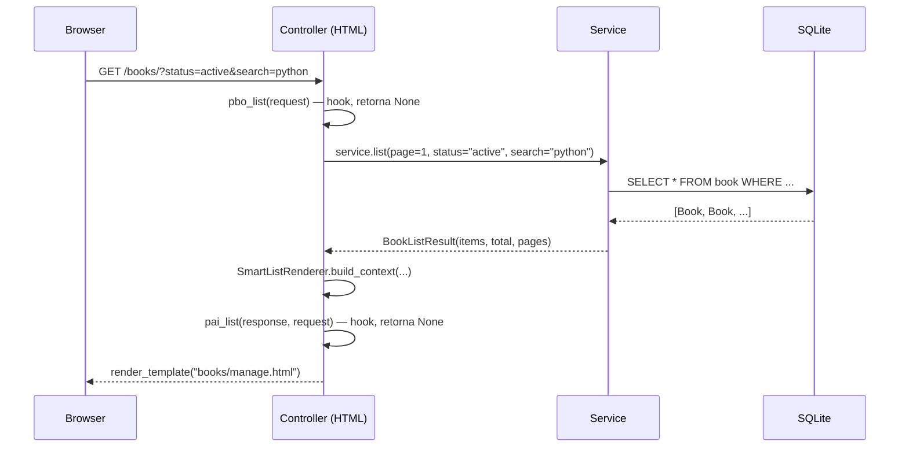
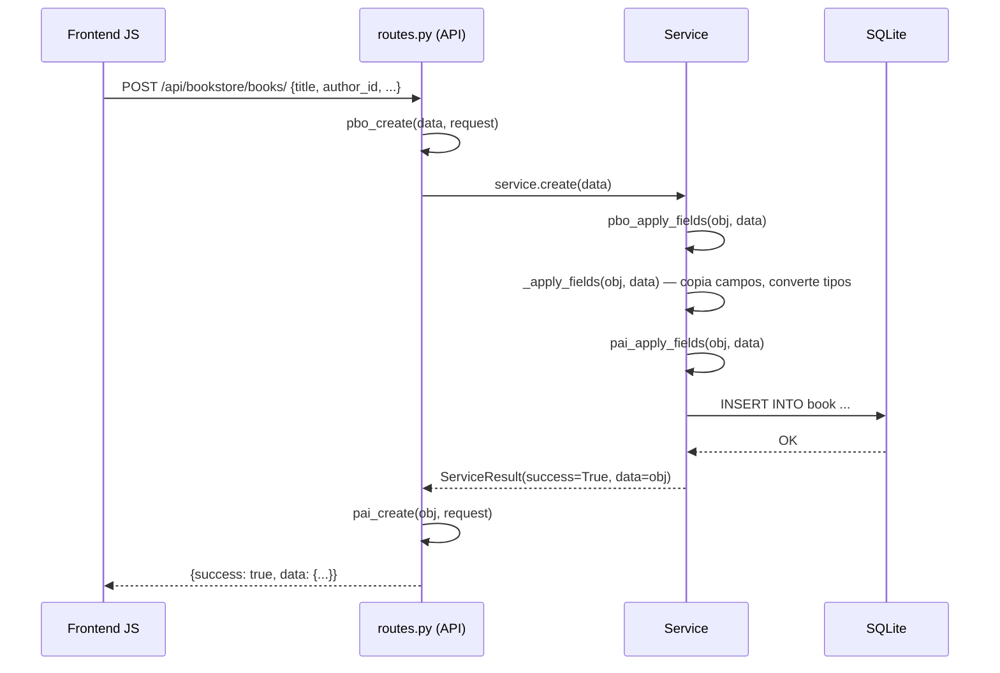

# 01 — Arquitetura do PyTeca

## O que é o PyTeca

PyTeca é um sistema de gerenciamento de biblioteca construído como demonstração
de **RAD (Rapid Application Development)** em Flask. O ponto central é que um
arquivo de model anotado com decorators gera automaticamente o CRUD completo
(controller, service, rotas de API e templates HTML) via um pipeline de geração
de código.

O projeto serve dois propósitos simultâneos:
1. **Aplicação funcional** — gerencia livros, autores e empréstimos
2. **Showcase de arquitetura** — demonstra como usar geração de código para
   acelerar desenvolvimento CRUD sem abrir mão de qualidade ou customização

## Stack

| Camada | Tecnologia |
|---|---|
| Backend | Flask 3, SQLAlchemy (ORM), Flask-Login, Flask-CORS |
| Banco | SQLite (dev) — sem Alembic hoje, migrações manuais via `ALTER TABLE` |
| Frontend | Bootstrap 5, Nice Admin theme, Vanilla JS |
| Templates | Jinja2 (HTML), Jinja2 com extensão `.j2` (geração de código) |
| Agendamento | APScheduler (tarefas em background) |
| Ambiente | Python 3.10+, Windows, venv |

## Estrutura de pastas

```
src/
├── annotations/          # @label, @plural, @listview, @form, @choices, @permission, etc.
├── api/routes/           # Blueprints de API REST (JSON)
│   ├── bookstore/        # book_routes.py, author_routes.py, loan_routes.py
│   └── core/             # admin/, builder/, notifications, auth, etc.
├── controller/           # Blueprints de views HTML
│   ├── bookstore/        # book.py, author.py, loan.py  ← GERADOS
│   └── core/             # web.py, auth.py, admin/, builder/
├── db/                   # database.py (SQLAlchemy init)
├── model/
│   ├── bookstore/        # book.py, author.py, loan.py  ← editar aqui
│   └── core/             # user.py, role.py, system_config.py, etc.
├── services/
│   ├── bookstore/        # book_service.py, etc.  ← GERADOS
│   └── core/             # config_service.py, task_service.py, etc.
├── templates/
│   ├── _components/      # smart_list.html (componente reutilizável)
│   ├── bookstore/        # books/, authors/, loans/  ← GERADOS
│   └── core/             # base.html, login.html, admin/, etc.
├── utils/
│   ├── generate_from_model.py   # CLI e pipeline de geração
│   ├── hooks_scaffold.py        # criação de _hooks.py por model
│   ├── permissions_sync.py      # sincronização Role/Permission
│   ├── smart_list/              # config.py, renderer.py, export.py
│   └── generate_model/
│       └── templates/standard/  # *.j2 — templates do gerador
└── main.py               # create_app(), context processors, CLI
```

## Fluxo de uma request web



## Fluxo de uma request de API (criação)



## "Código gerado" vs "código que você escreve"

Esta distinção é o coração do projeto e a causa de todas as regras que
aparecem nos outros manuais:

| O que é gerado (nunca edite) | O que é seu (edite livremente) |
|---|---|
| `controller/bookstore/book.py` | `model/bookstore/book.py` |
| `services/bookstore/book_service.py` | `controller/bookstore/book_hooks.py` |
| `api/routes/bookstore/book_routes.py` | `services/bookstore/book_service_hooks.py` |
| `templates/bookstore/books/*.html` | `api/routes/bookstore/book_routes_hooks.py` |
| | `utils/generate_model/templates/standard/*.j2` |

Se você editar um arquivo gerado, a próxima execução de
`generate --overwrite` desfaz a edição. Use os arquivos `_hooks.py`
(criados uma vez por model, nunca sobrescritos) para customizar
comportamento — ver `07-customizacao-hooks.md`.

## Usando só partes do projeto

O PyTeca foi construído em camadas razoavelmente desacopladas. Se você
quiser extrair apenas uma peça para outro projeto Flask:

| Peça | Dependências mínimas | Manual |
|---|---|---|
| **SmartList** (tabelas paginadas/filtradas) | `utils/smart_list/`, `templates/_components/smart_list.html`, Bootstrap 5 | `03-smartlist.md` |
| **Gerador de CRUD** | `utils/generate_from_model.py`, `utils/generate_model/templates/`, `annotations/` | `02-gerador-de-codigo.md` |
| **Versionamento de código** | `model/core/admin/code_snapshot.py`, `utils/versioning.py`, SQLAlchemy | `04-versionamento.md` |
| **RBAC** | `model/core/role.py`, `model/core/permission.py`, `utils/permissions_sync.py` | `05-permissoes.md` |
| **Task Scheduler** | `services/core/admin/task_service.py`, APScheduler | `06-task-scheduler.md` |
