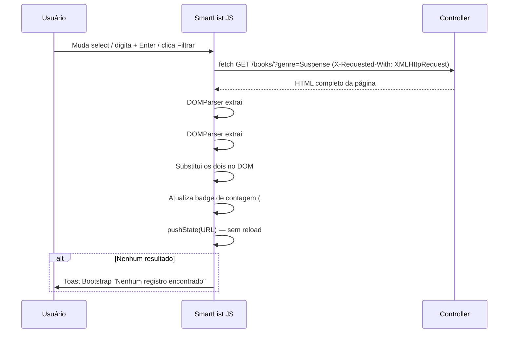

# 03 — SmartList

## O que é

A SmartList é o componente de listagem reutilizável do PyTeca. Encapsula
paginação, ordenação por coluna, filtros (texto, select com SELECT DISTINCT,
boolean), exportação (CSV, Excel, PDF), layout persistido por usuário
(colunas reordenáveis e ocultáveis) e atualização via AJAX sem reload de página.

Qualquer tela do projeto que lista registros usa a SmartList — incluindo as
geradas automaticamente pelo CrudGen.

## Usando em um template existente

```jinja


{{ smart_list(sl, row_actions=_row_actions) }}


  {{ sl_scripts() }}

```

`sl` é o objeto de contexto retornado por `SmartListRenderer.build_context()`,
passado pelo controller via `render_template(..., sl=sl)`.

## `SmartListConfig` — configuração estática

```python
from utils.smart_list import ColumnDef, FilterDef, SmartListConfig

SMART_LIST_CONFIG = SmartListConfig(
    list_id="books",           # identifica esta SmartList na página (deve ser único)
    endpoint="books.list",     # endpoint Flask para paginação/ordenação
    columns=[
        ColumnDef("id",          "ID",     sortable=True, width="60px"),
        ColumnDef("title",       "Título", sortable=True),
        ColumnDef("author_name", "Autor",  sortable=False),  # @property plana, sem ponto
        ColumnDef("status",      "Status", sortable=False, width="100px", align="center"),
    ],
    filters=[
        FilterDef("search", "Buscar", type="text", placeholder="Título ou autor..."),
    ],
    default_sort="title",
    default_dir="asc",
    page_sizes=[10, 20, 50, 100],
    default_page_size=20,
    exportable=True,
    export_filename="livros",
    show_count=True,           # exibe badge de total de registros
)
```

### `ColumnDef` — parâmetros

| Parâmetro | Tipo | Descrição |
|---|---|---|
| `key` | str | Campo no objeto ORM. **Nunca use ponto** (`user.username` quebra Jinja) — use `@property` plana (`user_username`) |
| `label` | str | Rótulo da coluna |
| `sortable` | bool | Permite ordenar por essa coluna. Só colunas do banco direto — **nunca** relacionamentos |
| `width` | str\|None | Ex: `"100px"`, `"10%"`. None = automático |
| `align` | str | `"start"`, `"center"`, `"end"` |
| `hidden_default` | bool | Começa oculta (usuário pode reexibir) |

### `FilterDef` — tipos

| `type` | Comportamento |
|---|---|
| `"text"` | Input com debounce — filtra ao clicar Filtrar ou Enter |
| `"select"` | `<select>` que filtra ao mudar (AJAX). Requer `options` |
| `"boolean"` | Toggle switch |

```python
# Filtro select estático
FilterDef("status", "Status", type="select",
          options=[("active","Ativo"), ("draft","Rascunho")])

# Filtro select dinâmico (@choices — SELECT DISTINCT)
# Não use FilterDef para isso. Use @choices no model:
# @choices("genre", label="Gênero")
# O controller gera o FilterDef via service.distinct_values("genre")
```

## Filtros AJAX — como funciona

Quando o usuário interage com um filtro, `slFilterSubmit(form)` é chamado:



O controller detecta a presença do header `X-Requested-With: XMLHttpRequest`
para saber que é uma requisição AJAX? **Não** — hoje ele retorna o HTML
completo em qualquer caso. O JS extrai apenas os divs necessários via
`DOMParser`. Isso simplifica o controller (sem lógica de "é AJAX?") a custo
de um payload ligeiramente maior, o que é aceitável para as volumes do PyTeca.

## Exportação

```
GET /books/?export=csv
GET /books/?export=excel
GET /books/?export=pdf
```

A exportação respeita os filtros ativos na query string — exporta os mesmos
registros que aparecem na tela, não a tabela inteira (a menos que não haja
filtros aplicados).

## Layout persistido por usuário

O `UserLayoutPref` model armazena por usuário + `list_id`:
- Quais colunas estão visíveis
- A ordem das colunas (drag-and-drop)
- O `per_page` preferido

O controller carrega este layout no início de `list()` e o passa para
`SmartListRenderer.build_context(user_layout=user_layout)`.

## Badge de contagem

```html
<!-- Gerado automaticamente se show_count=True no SmartListConfig -->
<span id="sl-count-books">
  <i class="bi bi-list-ul"></i>
  <span class="sl-count-value">42</span>
</span>
```

O JS de AJAX atualiza `.sl-count-value` após cada filtro, mantendo o número
sincronizado sem reload de página (fix17).

## Usando SmartList em outro projeto Flask

Dependências mínimas:

1. `utils/smart_list/config.py` — `ColumnDef`, `FilterDef`, `SmartListConfig`
2. `utils/smart_list/renderer.py` — `SmartListRenderer`
3. `utils/smart_list/export.py` — `export_csv`, `export_excel`, `export_pdf`
4. `templates/_components/smart_list.html` — o componente Jinja2
5. `static/css/smart_list.css` — estilos (variáveis CSS do Bootstrap 5)
6. Bootstrap 5 + Bootstrap Icons no template base

Não depende de: SQLAlchemy, Flask-Login, APScheduler, nem de nenhuma outra
parte do PyTeca. Os dados são passados como uma lista Python comum — o
componente só precisa de objetos que tenham os atributos listados nas `ColumnDef`.
