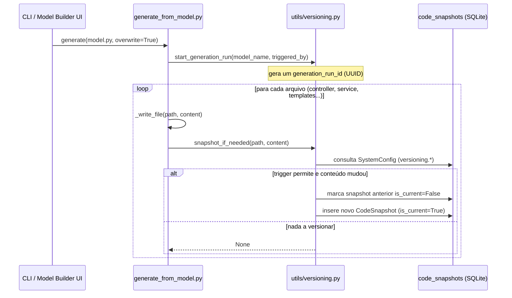

# 04 — Versionamento de Código Gerado

## Visão geral

Toda vez que o CrudGen (ou a futura IDE interna) escreve um arquivo no disco,
o sistema pode guardar uma cópia completa do conteúdo anterior numa tabela
do banco — `code_snapshots`. Isso cria um histórico navegável de qualquer
arquivo gerado, sem depender de Git nem de arquivos `.bak` soltos pelo
projeto.



## Por que não usamos Git para isso

Foi avaliado usar Git como motor de versionamento (um repositório paralelo,
interno, registrando cada escrita como commit). A decisão foi por uma
tabela no banco porque:

- O projeto já é 100% CRUD + SmartList sobre SQLite — reaproveitar essa
  mesma infraestrutura para listar/filtrar/paginar o histórico é imediato
- Não introduz uma segunda ferramenta operacional rodando dentro da
  aplicação (lock files, configuração de usuário/email do Git interno, risco
  de confundir com o histórico real do projeto que você cura manualmente
  no GitHub)
- Metadados de negócio (qual model gerou o arquivo, se foi CLI ou UI, qual
  usuário editou manualmente) ficam em colunas normais, sem precisar de
  convenções de mensagem de commit

O trade-off: não temos branches nem merge. Não é um requisito hoje — o
objetivo é "ver o que mudou e poder voltar", que a tabela cobre bem.

## Schema — `CodeSnapshot`

| Coluna | Tipo | Descrição |
|---|---|---|
| `file_path` | string | Caminho do arquivo (relativo ao projeto) |
| `content` | text | Conteúdo **completo** do arquivo nesse momento (não é diff incremental) |
| `content_hash` | string(64) | SHA-256 do conteúdo — usado para detectar se algo realmente mudou |
| `size_bytes` | int | Tamanho em bytes |
| `origin` | string | `generated` \| `manual_edit` \| `restore` \| `pre_overwrite` |
| `triggered_by` | string | `"cli:generate"`, `"ui:model_builder"`, `"ide:save"` |
| `model_name` | string | Nome do model relacionado (`Book`, `Loan`), se aplicável |
| `generation_run_id` | string(36) | UUID que agrupa todos os arquivos de uma mesma execução de `generate()` |
| `is_current` | bool | `True` = é a versão hoje presente no disco para esse `file_path` |
| `parent_snapshot_id` | int (FK) | De qual snapshot este partiu — monta uma linha do tempo real (A→B→C) |
| `created_at` | datetime | Quando o snapshot foi criado |
| `created_by_user_id` | int (FK) | Usuário, se a escrita veio de uma ação logada (UI) |

### Por que guardar o conteúdo completo, e não um diff incremental

Guardar o texto inteiro de cada versão (em vez de patches) é o que permite
que a futura tela de **diff visual** simplesmente leia duas linhas da tabela
e rode `difflib` entre elas — sem precisar reconstruir o estado aplicando
uma cadeia de patches. Isso foi decidido propositalmente para que a tela de
diff/IDE não exija migrar o schema quando for construída.

### Por que `generation_run_id`

Uma única chamada de `python main.py generate --model book.py --overwrite`
toca de 5 a 7 arquivos (model, controller, service, routes, manage.html,
detail.html, form_modal.html). Sem agrupar, o histórico ficaria fragmentado
em linhas soltas sem relação visível entre si. Com o `generation_run_id`
compartilhado, a futura tela de histórico mostra "Geração de 17/06 14:32 —
6 arquivos alterados" como uma unidade, com opção de reverter todos juntos
ou individualmente.

## Configuração — `SystemConfig` (grupo `versioning`)

Todas as chaves abaixo são lidas via `ConfigService.get(key, default=...)` e
podem ser alteradas em runtime (sem redeploy) através da tabela
`system_config` — não há nada de versionamento hardcoded em `.env`.

| Chave | Tipo | Padrão | Descrição |
|---|---|---|---|
| `versioning.enabled` | bool | `True` | Liga/desliga todo o sistema de versionamento |
| `versioning.trigger` | string | `"on_diff"` | Ver tabela de triggers abaixo |
| `versioning.retention_days` | int | `0` | Dias para manter snapshots. `0` = nunca expira |
| `versioning.retention_max_per_file` | int | `0` | Máx. de snapshots por arquivo. `0` = ilimitado |
| `versioning.snapshot_on_manual_save` | bool | `True` | Versiona também saves feitos pela futura IDE interna |

**Decisão de produto**: por padrão, nada é apagado automaticamente
(`retention_days=0` e `retention_max_per_file=0`). A limpeza só roda quando
o usuário explicitamente configura um limite acima de zero.

### Triggers disponíveis (`versioning.trigger`)

| Valor | Quando versiona |
|---|---|
| `always` | A cada escrita, mesmo sem mudança de conteúdo (mais volume, mais simples de raciocinar) |
| `on_diff` (padrão) | Só quando o hash do novo conteúdo é diferente do último salvo para aquele arquivo |
| `on_overwrite` | Só quando a geração usa `--overwrite` (a primeira criação de um arquivo não conta) |
| `manual_only` | Nunca versiona automaticamente — só por chamada explícita a `snapshot_if_needed()` |

## Onde isso vive no código

```
model/core/admin/code_snapshot.py     ← tabela CodeSnapshot
utils/versioning.py                   ← snapshot_if_needed(), cleanup_old_snapshots()
utils/ensure_default_config.py        ← seed das chaves versioning.* (idempotente)
utils/generate_from_model.py          ← ÚNICO ponto de integração: _write_file()
services/core/admin/task_service.py   ← job de limpeza (24h) via APScheduler já existente
```

**Importante**: nenhum arquivo `.j2` conhece o sistema de versionamento.
A integração acontece em um único lugar (`_write_file()`), o que significa
que adicionar versionamento não exigiu tocar em nenhum template — e
remover/trocar a estratégia de versionamento no futuro também não vai
exigir tocar nos `.j2`.

## Fluxo de `generation_run_id` — CLI vs UI

```python
# CLI (python main.py generate --model book.py --overwrite)
# -> _run_generation() chama start_generation_run() automaticamente
#    com triggered_by="cli:generate", se ainda não houver um run ativo.

# Model Builder UI
# -> model_generator.py chama start_generation_run() explicitamente
#    ANTES de chamar generate(), com triggered_by="ui:model_builder",
#    para que o agrupamento reflita a origem correta.
```

Isso usa `contextvars.ContextVar` (não uma variável global simples) — seguro
mesmo se o servidor um dia rodar com `async`/múltiplas threads atendendo
requests simultâneas, porque cada contexto de execução tem seu próprio valor.

## Job de limpeza automática

Reaproveita o mesmo `APScheduler` já usado para fila de mensagens e tarefas
agendadas (ver `06-task-scheduler.md`). Roda a cada 24h e só remove algo se
`retention_days` ou `retention_max_per_file` estiverem configurados acima de
zero. Nunca remove o snapshot marcado como `is_current=True`, mesmo que a
política de retenção mandasse — a versão atualmente em disco nunca é apagada
do histórico.

## O que ainda não existe (intencionalmente, por ora)

- **Tela de histórico/diff visual** — o schema já está pronto para isso
  (conteúdo completo + `parent_snapshot_id`), mas a UI fica para quando a
  IDE interna for desenhada, evitando construir uma tela descartável agora.
- **Restauração via UI** — mesma razão acima. Tecnicamente, restaurar hoje
  é só pegar o `content` de um snapshot antigo e escrever de volta no disco
  (criando um novo snapshot com `origin="restore"`), mas isso não tem
  endpoint/tela ainda.
- **Versionamento de saves manuais da IDE** — a chave
  `versioning.snapshot_on_manual_save` já existe na configuração, esperando
  o dia em que a IDE interna chamar `snapshot_if_needed(..., origin="manual_edit")`.
