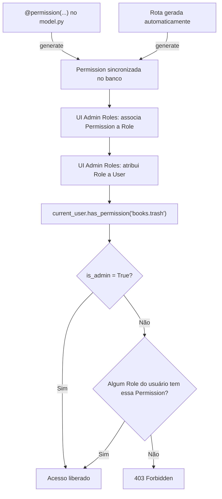

# 05 — Permissões e Controle de Acesso (RBAC)

## Visão geral

O sistema de permissões tem **um único ponto de decisão em runtime**
(`User.has_permission()`), alimentado por **duas camadas que nascem no
código**, nunca diretamente do banco ou da UI:



**Princípio "código lidera, banco segue"**: a tabela `permissions` nunca
recebe uma linha criada manualmente via UI. Toda `Permission` existe porque
o código (rota gerada ou anotação `@permission`) a declarou. A UI de Admin
Roles só lê o que já foi sincronizado e permite associar/atribuir — nunca
criar uma permissão do nada.

## Duas camadas (por decisão de produto, sem Camada 3 de campo por agora)

### Camada 1 — Rota (automática, sem anotação)

Toda vez que `generate()` processa um model, ele sincroniza automaticamente
7 permissões padrão, no formato `<plural>.<acao>`:

| Ação | Permissão gerada (ex: model Book, plural "books") |
|---|---|
| Listar | `books.list` |
| Detalhe | `books.detail` |
| Criar | `books.create` |
| Editar | `books.update` |
| Lixeira | `books.trash` |
| Restaurar | `books.restore` |
| Excluir permanente | `books.delete_permanent` |

Você não escreve nada para isso existir — é automático para qualquer model
gerado pelo CrudGen.

### Camada 2 — Model (`@permission`, granularidade de negócio)

Para ações que não mapeiam 1:1 para uma rota padrão, ou quando você quer
já amarrar a um papel específico no momento da geração:

```python
@permission("send_overdue_notice", role_required="librarian",
            description="Enviar aviso de atraso por e-mail")
class Book(db.Model):
    ...
```

Isso sincroniza `books.send_overdue_notice` no banco e, se o papel
`librarian` ainda não existir, ele é criado automaticamente — sempre
associando a nova permissão a ele.

**Não implementado por decisão de produto**: Camada 3 (permissão por
campo, ex: "só admin vê o campo salário"). Avaliada e descartada por
agora — pode ser revisitada depois se surgir um caso de uso real.

## Unificação de `is_admin` com Role/Permission

O projeto tinha dois caminhos de autorização coexistindo: um campo
`User.is_admin` checado diretamente em alguns controllers, e o sistema
`Role`/`Permission` em outros. Isso é exatamente o "múltiplos pontos de
verdade" que se queria evitar.

**Resolução**: `has_permission()` agora trata `is_admin=True` como "tem
todas as permissões", sem precisar de nenhuma linha em `role_permissions`.
Código que já checava `current_user.is_admin` diretamente continua
funcionando sem alteração — mas deixou de ser um caminho "paralelo": é
coberto pelo mesmo método central.

```python
def has_permission(self, permission_name):
    if self.is_admin:
        return True
    for role in self.roles:
        for perm in role.permissions:
            if perm.name == permission_name:
                return True
    return False
```

## Performance — eager loading no `user_loader`

`has_permission()` itera `self.roles` e, para cada role, `role.permissions`.
Sem cuidado, isso gera consultas lazy (N+1) a cada chamada — uma página com
vários decorators `@permission_required` checando ações diferentes
multiplicaria o custo.

Resolvido em um único lugar: o `user_loader` do Flask-Login (chamado uma vez
por request) agora usa `joinedload` para já trazer roles + permissions
prontos em memória:

```python
@login_manager.user_loader
def load_user(user_id):
    return (
        db.session.query(User)
        .options(joinedload(User.roles).joinedload(Role.permissions))
        .filter(User.id == int(user_id))
        .first()
    )
```

## Onde isso vive no código

```
annotations/__init__.py              ← @permission, get_permissions_meta()
utils/permissions_sync.py            ← sync_model_permissions() — único ponto que cria Permission
utils/generate_from_model.py         ← chama o sync logo após resolver `plural`, antes de gerar arquivos
model/core/user.py                   ← has_permission() unificado com is_admin
main.py                              ← user_loader com eager loading
api/routes/core/admin/roles_api.py   ← API: list/create/delete Role, (des)associar Permission, atribuir/revogar Role de User
controller/core/admin/admin_roles.py ← view fina, serve o template
templates/core/admin/roles.html      ← UI: gestão de papéis, permissões e usuários
```

## API — `/api/admin/roles`

| Método | Rota | Descrição |
|---|---|---|
| `GET` | `/` | Lista todos os Roles com suas Permissions |
| `POST` | `/` | Cria um novo Role (vazio, sem permissões) |
| `DELETE` | `/<id>` | Remove um Role (bloqueado para o Role `admin`) |
| `GET` | `/permissions` | Lista todas as Permissions sincronizadas (somente leitura) |
| `POST` | `/<role_id>/permissions/<perm_id>` | Associa uma Permission a um Role |
| `DELETE` | `/<role_id>/permissions/<perm_id>` | Remove a associação |
| `GET` | `/users` | Lista usuários com seus Roles |
| `POST` | `/users/<user_id>/roles/<role_id>` | Atribui um Role a um usuário |
| `DELETE` | `/users/<user_id>/roles/<role_id>` | Revoga um Role de um usuário |

Note que **não existe** `POST /permissions` — é proposital. Permissions só
nascem da sincronização automática, nunca de uma chamada de API direta.

## Fluxo de uso típico

1. Você escreve `@permission(...)` no model (opcional — a Camada 1 já cobre
   o CRUD padrão sem isso).
2. Roda `python main.py generate --model ... --overwrite`.
3. Acessa `/admin/roles`, cria um Role (ex: "librarian") se ainda não
   existir.
4. Marca os checkboxes das permissões que esse Role deve ter — a tela já
   mostra todas agrupadas por model (`books.*`, `loans.*`, etc.).
5. Atribui o Role a um ou mais usuários, na tabela inferior da mesma tela.

## O que ainda não existe (intencionalmente)

- **YAML do menu com `requires_permission`** — a ideia de filtrar itens de
  menu por permissão foi desenhada em conversa, mas a integração com o
  context processor de menu ainda não foi implementada nesta entrega.
- **Camada 3 (permissão por campo)** — descartada por ora, conforme decisão
  de produto registrada acima.
