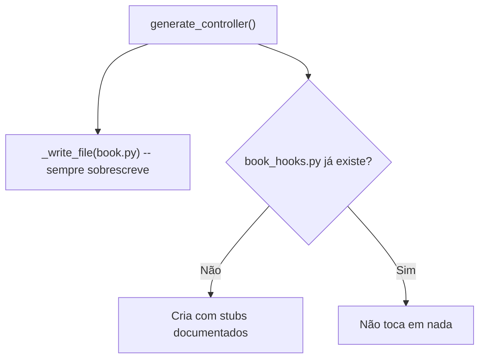

# 07 — Customização via Hooks Pré/Pós

## Por que hooks, e não marcadores `# CUSTOM:`

A primeira ideia avaliada para resolver "como customizar comportamento sem
perder a edição ao regenerar" foi marcar regiões no código gerado com
comentários (`# CUSTOM:inicio` / `# CUSTOM:fim`) e reinjetar esse trecho ao
regenerar. Essa abordagem foi descartada por decisão de produto: o risco de
reinjeção em posição errada (se o `.j2` mudar de estrutura entre versões,
ou se o marcador for removido/renomeado por acidente) era considerado alto
demais — é exatamente o tipo de bug sutil que já causamos antes neste
projeto com patches mal consolidados.

**Decisão**: hooks pré/pós em arquivos físicos separados. Geração e
customização nunca compartilham o mesmo arquivo — elimina por construção
o risco de reinjeção incorreta.

## Princípio central

```
controller/bookstore/book.py            ← gerado, sobrescrito a cada --overwrite
controller/bookstore/book_hooks.py       ← seu, criado uma vez, NUNCA sobrescrito

services/bookstore/book_service.py            ← gerado
services/bookstore/book_service_hooks.py       ← seu

api/routes/bookstore/book_routes.py            ← gerado
api/routes/bookstore/book_routes_hooks.py       ← seu
```

Um arquivo de hooks por camada (decisão de produto — não um único arquivo
compartilhado pelas três). Cada `_hooks.py` é escrito **uma única vez**: na
primeira geração daquele model. Se ele já existir, o gerador nunca o toca
de novo, independente de `--overwrite`.



## Pontos de hook disponíveis

### Controller (`book_hooks.py`)

| Hook | Quando dispara | Pode interceptar totalmente? |
|---|---|---|
| `pre_list(request)` | Antes de montar a query de listagem | Sim — retorne uma Response |
| `post_list(response, request)` | Depois de renderizar a página | Substitui a Response se retornar algo |
| `pre_create`, `post_create` | Reservados — hoje a criação de registros passa pela API (`routes.py.j2`), não pelo controller HTML. Mantidos no stub para o caso de você adicionar uma rota de criação direta no controller no futuro |
| `pre_update`, `post_update` | Mesma observação acima |
| `pre_delete(item_id, action)` | Antes de `trash` ou `delete_permanent` (`action` distingue qual) | Sim |
| `post_delete(item_id, action, result)` | Depois de `trash` ou `delete_permanent` | Não (já fora do fluxo) |

### Service (`book_service_hooks.py`)

| Hook | Quando dispara |
|---|---|
| `pre_apply_fields(obj, data)` | Início de `_apply_fields()`, antes de copiar o payload para o objeto. Retorne um `data` modificado para alterar o que será aplicado |
| `post_apply_fields(obj, data)` | Fim de `_apply_fields()`, depois de todos os campos setados, antes do `updated_at`. Ideal para calcular campos derivados que dependem de outros já aplicados |

### Routes/API (`book_routes_hooks.py`)

| Hook | Quando dispara | Pode interceptar totalmente? |
|---|---|---|
| `pre_list(request)` | Antes de processar `GET /` | Sim |
| `post_list(payload, request)` | Depois de montar o dict de resposta JSON | Substitui o payload se retornar algo |
| `pre_create(data)` | Antes de `POST /` chamar o service | Retorne `data` modificado |
| `post_create(obj)` | Depois de criar com sucesso | Não |
| `pre_update(id, data)` | Antes de `PUT/PATCH /<id>` | Retorne `data` modificado |
| `post_update(obj)` | Depois de atualizar com sucesso | Não |
| `pre_delete(id, action)` | Antes de `trash` ou `DELETE /<id>` | Sim |
| `post_delete(id, action, result)` | Depois de trash/delete | Não |

## Exemplo de uso

```python
# services/bookstore/book_service_hooks.py (seu arquivo, edite livremente)

def pre_apply_fields(obj, data):
    """Normaliza o ISBN removendo hifens antes de salvar."""
    if "isbn" in data and data["isbn"]:
        data["isbn"] = data["isbn"].replace("-", "")
    return data


def post_apply_fields(obj, data):
    """Define disponibilidade automática com base na quantidade."""
    obj.available = obj.quantity if obj.quantity else 0
    return None
```

```python
# controller/bookstore/book_hooks.py

def pre_delete(item_id, action):
    """Bloqueia exclusão permanente de livros com ID < 10 (catálogo seed)."""
    if action == "delete_permanent" and item_id < 10:
        from flask import flash, redirect, url_for
        flash("Livros do catálogo inicial não podem ser excluídos.", "warning")
        return redirect(url_for("books.list"))
    return None
```

## Padrão de import tolerante

Cada `.j2` importa o hook correspondente de forma tolerante a ausência:

```python
def _noop(*args, **kwargs):
    return None

try:
    from services.bookstore import book_service_hooks as _hooks
except ImportError:
    _hooks = None

def _hook(name):
    return getattr(_hooks, name, _noop) if _hooks else _noop
```

Isso significa que:
- Funciona mesmo se `_hooks.py` ainda não existir (geração antiga, antes
  desta funcionalidade existir)
- Funciona mesmo se você remover uma função específica do stub — o
  `getattr(..., _noop)` cai de volta para "nenhum efeito"
- Você nunca precisa importar nada manualmente nos arquivos gerados —
  a chamada já está lá

## CLI — regeneração parcial (complementar aos hooks)

Combinado junto com hooks, mas com escopo próprio: flags para regenerar só
parte dos artefatos, útil quando você editou manualmente o HTML e não quer
arriscar perdê-lo mesmo com o versionamento (`fix16`) como rede de
segurança.

**Não incluído nesta entrega** — fica registrado como próximo passo
natural após hooks, caso você queira.

## O que NÃO foi feito (limite consciente)

Hooks só existem nos pontos listados acima — não é possível interceptar o
meio de um algoritmo (ex: o cálculo interno de paginação do `list()`).
Isso foi uma troca consciente: cobrir os pontos onde customização de
comportamento de negócio realmente costuma viver (antes/depois de uma
operação), sem tentar prever todo ponto possível de extensão, o que
tornaria o sistema de hooks tão complexo quanto o código que ele deveria
simplificar.

Se um dia for necessário customizar algo fora desses pontos, a opção é
editar o arquivo gerado diretamente — nesse caso, o versionamento
(`docs/manual/04-versionamento.md`) é a rede de segurança.
