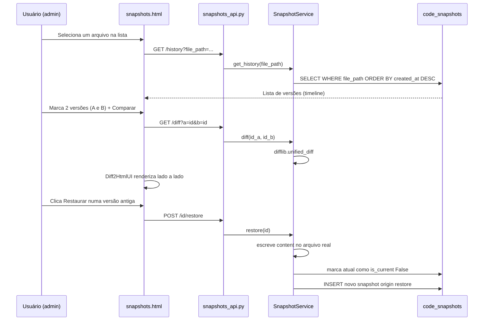

# 09 — Histórico e Diff de Versões

## O que esta tela faz (e não faz)

`/admin/snapshots` é a interface que finalmente consome o sistema de
versionamento desenhado desde o fix16 (`CodeSnapshot`). Sua função é
estritamente:

1. **Listar** arquivos que têm histórico capturado
2. **Mostrar** a linha do tempo de versões de um arquivo
3. **Comparar** duas versões com diff visual lado a lado
4. **Restaurar** uma versão antiga, escrevendo-a de volta no disco

**O que não faz**: não é um editor. Não permite digitar código novo. Para
edição de verdade, a ferramenta é o code-server (`docs/setup/code-server.md`),
fora da aplicação.

## Por que isso ficou pendente desde o fix16

O schema do `CodeSnapshot` foi desenhado propositalmente com conteúdo
completo (não diff incremental) e `parent_snapshot_id`, exatamente para
que esta tela pudesse ser construída sem migração de dados — e foi isso
que aconteceu: nenhuma alteração de schema foi necessária para esta entrega.

## Fluxo de uso



## Por que a restauração nunca é silenciosa

Restaurar uma versão antiga cria um novo snapshot (`origin=restore`) em
vez de simplesmente sobrescrever o histórico:

- A versão que estava atual antes da restauração não é perdida — vira
  uma entrada normal do histórico
- O novo snapshot tem `parent_snapshot_id` apontando para o que era
  atual, preservando a linha do tempo real
- Se a restauração for um erro, basta "restaurar a restauração" — é só
  mais uma versão no histórico, não uma operação especial

## Diff visual

Usa diff2html (CDN) para renderizar o diff unificado gerado pelo
`difflib` do Python — o backend nunca lida com HTML de diff, só texto no
formato padrão unified diff (o mesmo que `git diff` produz):

```python
unified = "".join(difflib.unified_diff(
    lines_a, lines_b, fromfile=label_a, tofile=label_b, lineterm="\n",
))
```

## API — /api/admin/snapshots

| Método | Rota | Descrição |
|---|---|---|
| GET | /files?search=X | Lista arquivos com histórico |
| GET | /history?file_path=X | Histórico completo de um arquivo |
| GET | /id | Conteúdo completo de um snapshot (preview) |
| GET | /diff?a=id&b=id | Diff unificado entre duas versões do mesmo arquivo |
| POST | /id/restore | Restaura uma versão (grava no disco + novo snapshot) |

## Onde isso vive no código

```
model/core/admin/code_snapshot.py        já existia (fix16)
services/core/admin/snapshot_service.py  novo
api/routes/core/admin/snapshots_api.py   novo
controller/core/admin/snapshot_viewer.py novo
templates/core/admin/snapshots.html      novo
```

## Permissão

Rota protegida por `@permission_required("admin")`, mesma camada das
demais telas administrativas. Item de menu com `requires_permission: "admin"`.
